目录

[JVM](./../JVM.md)

[2字节码指令集](./2字节码指令集.md)

# 2字节码指令集

## 1. 概述

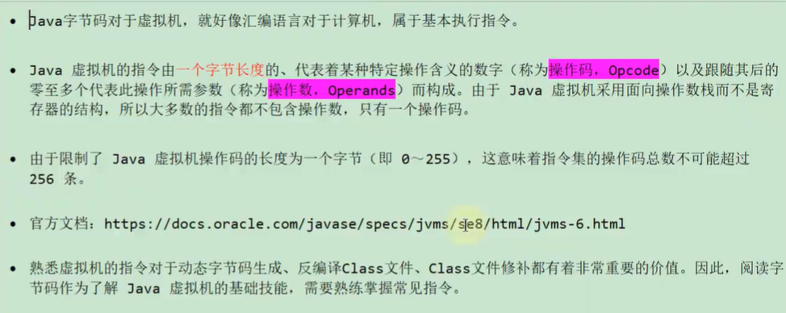

### 执行模型


### 字节码与数据类型

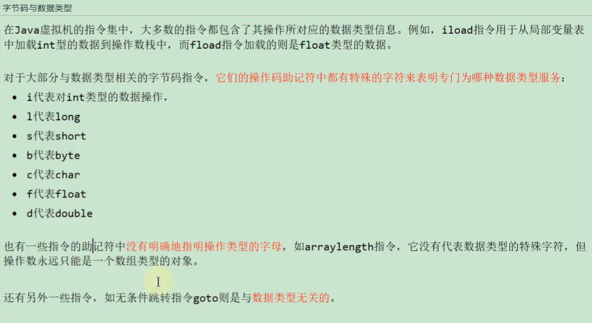

### 指令分析

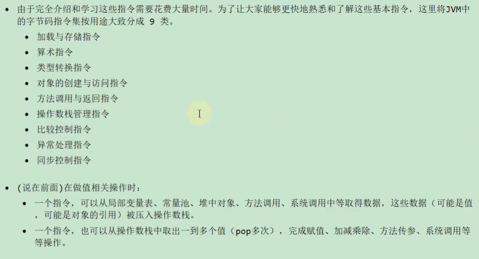

## 2 加载与存储指令

### 1作用

加载和存储指令用于**将数据从栈帧的局部变量表和操作数栈之间来回传递。**

### 2常用指令

1. 【**局部变量压栈指令**】将一个**局部变量加载到操作数栈**：**`xload、xload_<n>`**（其中x为i、l、f、d、a，n为0到3）
2. 【**常量入栈指令**】将**一个常量加载到操作数栈**：`bipush、sipush、ldc、ldc_w、ldc2_w、aconst_null、iconst_m1、iconst_<i>、lconst_<l>）、fconst_<f>、dconst_<d>`
3. 【出栈**装入局部变量表指令**】将一个数值从操作数栈**存储到局部变量表**：**`xstore、xstore_<n>`**（其中x为i、l、f、d、a，n为0到3）；`xastore`（其中x为i、l、f、d、a、b、c、s）
4. 扩充局部变量表的访问索引的指令：`wide`。

上面所列举的指令助记符中，有一部分是以尖括号结尾的（例如iload_<n>）。这些指令助记符实际上代表了一组指令（例如iload_<n>代表了`iload_0、iload_1、iload_2`和`iload_3`这几个指令）。这几组指令都是某个带有一个操作数的通用指令（例如iload）的特殊形式，**对于这若干组特殊指令来说，它们表面上没有操作数，不需要进行取操作数的动作，但操作数都隐含在指令中。**

除此之外，它们的语义与原生的通用指令完全一致（例如`iload_0`的语义与操作数为0时的iload指令语义完全一致）。在尖括号之间的字母指定了指令隐含操作数的数据类型，<n>代表非负的整数，<i>代表是int类型数据，<l>代表long类型，<f>代表float类型，<d>代表double类型。

操作byte、char、short和boolean类型数据时，经常用int类型的指令来表示。


### 3再谈操作数栈与局部变量表

**操作数栈（Operand Stacks）**

我们知道，Java字节码是Java虚拟机所使用的指令集。因此，它与Java虚拟机基于栈的计算模型是密不可分的。在解释执行过程中，每当为Java方法分配栈桢时，Java虚拟机往往需要开辟一块额外的空间作为操作数栈，**来存放计算的操作数以及返回结果。**

具体来说便是：执行每一条指令之前，Java虚拟机要求该指令的操作数已被压入操作数栈中。**在执行指令时，Java虚拟机会将该指令所需的操作数弹出，并且将指令的结果重新压入栈中。**


以加法指令iadd为例。假设在执行该指令前，栈顶的两个元素分别为int值1和int值2，那么iadd指令将弹出这两个int，并将求得的和int值3压入栈中。


由于iadd指令只消耗栈顶的两个元素，因此，对于离栈顶距离为2的元素，即图中的问号，iadd 指令并不关心它是否存在，更加不会对其进行修改。

#### **局部变量表（Local Variables）**

Java方法栈桢的另外一个重要组成部分则是局部变量区，字节码程序可以将计算的结果缓存在局部变量区之中。

实际上，Java虚拟机将局部变量区当成一个数组，依次存放this指针（仅非静态方法），所传入的参数，以及字节码中的局部变量。

和操作数栈一样，long类型以及double类型的值将占据两个单元，其余类型仅占据一个单元。


举例：

```java
public void foo(long l, float f) {
    {
        int i = e;
    }
    {
        String s = "Hello, World";
    }
}
```

对应的图示：


this表示当前类的引用，l和f的类型的值占两个槽位，i和s变量由于分别在各自代码块中，没有共同的生命周期，所以占同一个槽位（即槽位复用）

在栈帧中，与性能调优关系最为密切的部分就是局部变量表。局部变量表中的变量也是重要的垃圾回收根节点，只要被局部变量表中直接或间接引用的对象都不会被回收。

### 4 局部变量压栈指令

iload 从局部变量中装载int类型值

lload 从局部变量中装载long类型值

fload 从局部变量中装载float类型值

dload 从局部变量中装载double类型值

aload 从局部变量中装载引用类型值（refernce）


iload_i 从局部变量i（i [0,3]）中装载int类型值

lload_i  从局部变量i（i [0,3]）中装载long类型值

fload_i 从局部变量i（i [0,3]）中装载float类型值

dload_i 从局部变量i（i [0,3]）中装载double类型值 

aload_i 从局部变量i中装载引用类型值（i ,[0,3]）


iaload 从数组中装载int类型值

laload 从数组中装载long类型值

faload 从数组中装载float类型值

daload 从数组中装载double类型值

aaload 从数组中装载引用类型值

baload 从数组中装载byte类型或boolean类型值

caload 从数组中装载char类型值 

saload 从数组中装载short类型值


**局部变量压栈常用指令集**

| xload_n     | xload_0 | xload_1 | xload_2 | xload_3 |
| ----------- | ------- | ------- | ------- | ------- |
| **iload_n** | iload_0 | iload_1 | iload_2 | iload_3 |
| **lload_n** | lload_0 | lload_1 | lload_2 | lload_3 |
| **fload_n** | fload_0 | fload_1 | fload_2 | fload_3 |
| **dload_n** | dload_0 | dload_1 | dload_2 | dload_3 |
| **aload_n** | aload_0 | aload_1 | aload_2 | aload_3 |


#### **局部变量压栈指令剖析**

局部变量压栈指令将给定的局部变量表中的数据压入操作数栈。


这类指令大体可以分为：


- `xload_<n>`（x为i、l、f、d、a，n为0到3）

- `xload`（x为i、l、f、d、a）


说明：在这里，x的取值表示数据类型。


指令xload_n表示将第n个局部变量压入操作数栈，比如iload_1、fload_0、aload_0等指令。其中aload_n表示将一个对象引用压栈。


指令xload通过指定参数的形式，把局部变量压入操作数栈，当使用这个命令时，表示局部变量的数量可能超过了4个，比如指令iload、fload等。


举例：


```java
public void load(int num, Object obj, long count, boolean flag, short[] arr) {
    System.out.println(num);
    System.out.println(obj);
    System.out.println(count);
    System.out.println(flag);
    System.out.println(arr);
}
```


字节码执行过程：


### 5常量入栈指令

aconst_null 将null对象引用压入栈

iconst_m1 将int类型常量-1压入栈

iconst_i 将int类型常量i（i [0,5]）压入栈


lconst_i 将long类型常量i（i [0,1]）压入栈

fconst_i  将float类型常量i（i [0,1]）压入栈

dconst_i 将double类型常量i（i [0,1]）压入栈 

 

bipush 将一个8位带符号整数压入栈

sipush 将16位带符号整数压入栈

 

ldc 把常量池中的项压入栈

ldc_w 把常量池中的项压入栈（使用宽索引）

ldc2_w 把常量池中long类型或者double类型的项压入栈（使用宽索引）


**常量入栈常用指令集**

| xconst_n     | 范围                                              | xconst_null | xconst_m1 | xconst_0 | xconst_1 | xconst_2 | xconst_3 | xconst_4 | xconst_5 |
| ------------ | ------------------------------------------------- | ----------- | --------- | -------- | -------- | -------- | -------- | -------- | -------- |
| **iconst_n** | [-1, 5]                                           |             | iconst_m1 | iconst_0 | iconst_1 | iconst_2 | iconst_3 | iconst_4 | iconst_5 |
| **lconst_n** | 0, 1                                              |             |           | lconst_0 | lconst_1 |          |          |          |          |
| **fconst_n** | 0, 1, 2                                           |             |           | fconst_0 | fconst_1 | fconst_2 |          |          |          |
| **dconst_n** | 0, 1                                              |             |           | dconst_0 | dconst_1 |          |          |          |          |
| **aconst_n** | null, String literal, Class literal               | aconst_null |           |          |          |          |          |          |          |
| **bipush**   | 一个字节，28，[-27, 27 - 1]，即[-128, 127]        |             |           |          |          |          |          |          |          |
| **sipush**   | 两个字节，216，[-215, 215 - 1]，即[-32768, 32767] |             |           |          |          |          |          |          |          |
| **ldc**      | 四个字节，232，[-231, 231 - 1]                    |             |           |          |          |          |          |          |          |
| **ldc_w**    | 宽索引                                            |             |           |          |          |          |          |          |          |
| **ldc2_w**   | 宽索引，long或double                              |             |           |          |          |          |          |          |          |


#### **常量入栈指令剖析**


常量入栈指令的功能是将常数压入操作数栈，根据数据类型和入栈内容的不同，又可以分为const系列、push系列和ldc指令。


指令const系列：用于对特定的常量入栈，入栈的常量隐含在指令本身里。指令有：`iconst_<i>（i从-1到5）、lconst_<l>（1从0到1）、fconst_<f>（f从0到2）、dconst_<d>（d从0到1）、aconst_null`。比如，


- iconst_m1将-1压入操作数栈；

- iconst_x（x为0到5）将x压入栈；

- lconst_0、lconst_1分别将长整数0和1压入栈；

- fconst_0、fconst_1、fconst_2分别将浮点数0、1、2压入栈；

- dconst_0和dconst_1分别将double型0和1压入栈；

- aconst_null将null压入操作数栈；


从指令的命名上不难找出规律，指令助记符的第一个字符总是喜欢表示数据类型，i表示整数，l表示长整数，f表示浮点数，d表示双精度浮点，习惯上用a表示对象引用。如果指令隐含操作的参数，会以下划线形式给出。


指令push系列：主要包括bipush和sipush。它们的区别在于接收数据类型的不同，bipush接收8位整数作为参数，sipush接收16位整数，它们都将参数压入栈。


指令ldc系列：如果以上指令都不能满足需求，那么可以使用万能的


- ldc指令，它可以接收一个8位的参数，该参数指向常量池中的int、float或者String的索引，将指定的内容压入堆栈。

- 类似的还有ldc_w，它接收两个8位参数，能支持的索引范围大于ldc。

- 如果要压入的元素是long或者double类型的，则使用ldc2_w指令，使用方式都是类似的


总结如下：

| 类型                         | 常数指令                      | 范围    |
| ---------------------------- | ----------------------------- | ------- |
| int(boolean,byte,char,short) | iconst                        | [-1, 5] |
| bipush                       | [-128, 127]                   |         |
| sipush                       | [-32768, 32767]               |         |
| ldc                          | any int value                 |         |
| long                         | lconst                        | 0, 1    |
| ldc                          | any long value                |         |
| float                        | fconst                        | 0, 1, 2 |
| ldc                          | any float value               |         |
| double                       | dconst                        | 0, 1    |
| ldc                          | any double value              |         |
| reference                    | aconst                        | null    |
| ldc                          | String literal, Class literal |         |

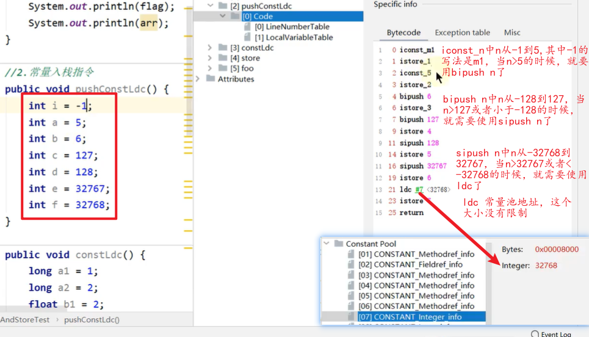


### 6出栈装入局部变量表指令


istore 将int类型值存入局部变量

lstore 将long类型值存入局部变量

fstore 将float类型值存入局部变量

dstore 将double类型值存入局部变量

astore 将将引用类型或returnAddress类型值存入局部变量

istore_0 将int类型值存入局部变量0

istore_1 将int类型值存入局部变量1

istore_2 将int类型值存入局部变量2

istore_3 将int类型值存入局部变量3

 

lstore_0 将long类型值存入局部变量0

lstore_1 将long类型值存入局部变量1

lstore_2 将long类型值存入局部变量2

 

lstore_3 将long类型值存入局部变量3

 

fstore_0 将float类型值存入局部变量0

 

fstore_1 将float类型值存入局部变量1

 

fstore_2 将float类型值存入局部变量2

 

fstore_3 将float类型值存入局部变量3

 

dstore_0 将double类型值存入局部变量0

 

dstore_1 将double类型值存入局部变量1

 

dstore_2 将double类型值存入局部变量2

 

dstore_3 将double类型值存入局部变量3

 

astore_0 将引用类型或returnAddress类型值存入局部变量0

 

astore_1 将引用类型或returnAddress类型值存入局部变量1

 

astore_2 将引用类型或returnAddress类型值存入局部变量2

 

astore_3 将引用类型或returnAddress类型值存入局部变量3

 

iastore 将int类型值存入数组中

 

lastore 将long类型值存入数组中

 

fastore 将float类型值存入数组中

 

dastore 将double类型值存入数组中

 

aastore 将引用类型值存入数组中

 

bastore 将byte类型或者boolean类型值存入数组中

 

castore 将char类型值存入数组中

 

sastore 将short类型值存入数组中

 

wide指令

 

wide 使用附加字节扩展局部变量索引


**出栈装入局部变量表常用指令集**

| xstore_n     | xstore_0 | xstore_1 | xstore_2 | xstore_3 |
| ------------ | -------- | -------- | -------- | -------- |
| **istore_n** | istore_0 | istore_1 | istore_2 | istore_3 |
| **lstore_n** | lstore_0 | lstore_1 | lstore_2 | lstore_3 |
| **fstore_n** | fstore_0 | fstore_1 | fstore_2 | fstore_3 |
| **dstore_n** | dstore_0 | dstore_1 | dstore_2 | dstore_3 |
| **astore_n** | astore_0 | astore_1 | astore_2 | astore_3 |


#### **出栈装入局部变量表指令剖析**


出栈装入局部变量表指令用于将操作数栈中栈顶元素弹出后，装入局部变量表的指定位置，用于给局部变量赋值。这类指令主要以store的形式存在，比如`xstore（x为i、l、f、d、a）、xstore_n（x为i、l、f、d、a，n为0至3）`。


- 其中，指令istore_n将从操作数栈中弹出一个整数，并把它值给局部变量索引n位置。

- 指令xstore由于没有隐含参数信息，故需要提供一个byte类型的参数类指定目标局部变量表的位置。


说明：

**一般说来，类似像store这样的命令需要带一个参数，用来指明将弹出的元素放在局部变量表的第几个位置。**但是，为了尽可能压缩指令大小，使用专门的istore_1指令表示将弹出的元素放置在局部变量表第1个位置。类似的还有istore_0、istore_2、istore_3，它们分别表示从操作数栈顶弹出一个元素，存放在局部变量表第0、2、3个位置。

由于局部变量表前几个位置总是非常常用，因**此这种做法虽然增加了指令数量，但是可以大大压缩生成的字节码的体积。**如果局部变量表很大，需要存储的槽位大于3，那么可以使用istore指令，外加一个参数，用来表示需要存放的槽位位置。


举例：


## 3算术指令

### 1作用

算术指令用于**对两个操作数栈上的值进行某种特定运算，并把结果重新压入操作数栈。**

### 2分类

大体上算术指令可以分为两种：对**整型数据**进行运算的指令与对**浮点类型数据**进行运算的指令。

### 3 byte、short、char和boolean类型说明

在每一大类中，都有针对Java虚拟机具体数据类型的专用算术指令。但没有直接支持byte、short、char和boolean类型的算术指令，对于这些数据的运算，都使用int类型的指令来处理。此外，在处理boolean、byte、short和char类型的数组时，也会转换为使用对应的int类型的字节码指令来处理。


### 4运算时的溢出


数据运算可能会导致溢出，例如两个很大的正整数相加，结果可能是一个负数。其实Java虚拟机规范并无明确规定过整型数据溢出的具体结果，仅规定了在处理整型数据时，只有除法指令以及求余指令中当出现除数为0时会导致虚拟机抛出异常ArithmeticException。


### 5 运算模式


**向最接近数舍入模式**：JVM要求在进行浮点数计算时，所有的运算结果都必须舍入到适当的精度，非精确结果必须舍入为可被表示的最接近的精确值，如果有两种可表示的形式与该值一样接近，将优先选择最低有效位为零的；


**向零舍入模式**：将浮点数转换为整数时，采用该模式，该模式将在目标数值类型中选择一个最接近但是不大于原值的数字作为最精确的舍入结果；


### 6NaN值使用

当一个**操作产生溢出时，将会使用有符号的`∞`无穷(大)表示**，如果某个操作结果**没有明确的数学定义的话，将会使用NaN值来表示**。而且所有使用NaN值作为操作数的算术操作，结果都会返回NaN；

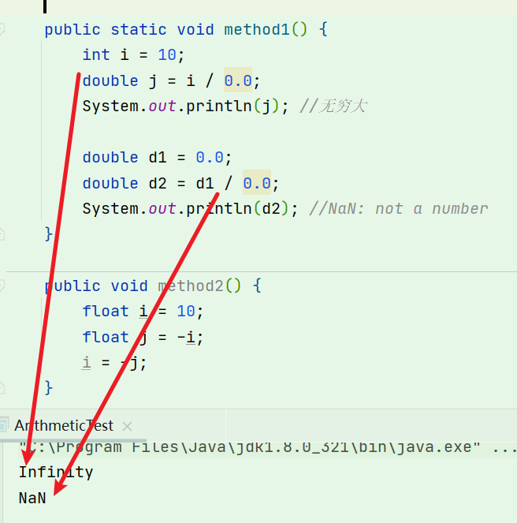


### 7所有算术指令


#### **整数运算**

 

iadd 执行int类型的加法

ladd 执行long类型的加法

isub 执行int类型的减法

lsub 执行long类型的减法

imul 执行int类型的乘法

lmul 执行long类型的乘法

idiv 执行int类型的除法

ldiv 执行long类型的除法

irem 计算int类型除法的余数

lrem 计算long类型除法的余数 

ineg 对一个int类型值进行取反操作

lneg 对一个long类型值进行取反操作

iinc 把**一个常量值加到一个int类型的局部变量上**

 

#### **逻辑运算**

 

**移位操作**

 

ishl 执行int类型的向左移位操作

lshl 执行long类型的向左移位操作

ishr 执行int类型的向右移位操作

lshr 执行long类型的向右移位操作

iushr 执行int类型的向右逻辑移位操作

lushr 执行long类型的向右逻辑移位操作

 

#### **按位布尔运算**

 

iand 对int类型值进行“逻辑与”操作

land 对long类型值进行“逻辑与”操作

ior 对int类型值进行“逻辑或”操作

lor 对long类型值进行“逻辑或”操作

ixor 对int类型值进行“逻辑异或”操作

lxor 对long类型值进行“逻辑异或”操作

 

#### **浮点运算**

 

fadd 执行float类型的加法

dadd 执行double类型的加法

fsub 执行float类型的减法

dsub 执行double类型的减法

 fmul 执行float类型的乘法

dmul 执行double类型的乘法

fdiv 执行float类型的除法

ddiv 执行double类型的除法

frem 计算float类型除法的余数

drem 计算double类型除法的余数 

fneg 将一个float类型的数值取反

dneg 将一个double类型的数值取反


#### **算术指令集**

| 算数指令     | int(boolean,byte,char,short) | long | float         | double        |      |
| ------------ | ---------------------------- | ---- | ------------- | ------------- | ---- |
| 加法指令     | iadd                         | ladd | fadd          | dadd          |      |
| 减法指令     | isub                         | lsub | fsub          | dsub          |      |
| 乘法指令     | imul                         | lmul | fmul          | dmul          |      |
| 除法指令     | idiv                         | ldiv | fdiv          | ddiv          |      |
| 求余指令     | irem                         | lrem | frem          | drem          |      |
| 取反指令     | ineg                         | lneg | fneg          | dneg          |      |
| 自增指令     | iinc                         |      |               |               |      |
| 位运算指令   | 按位或指令                   | ior  | lor           |               |      |
| 按位或指令   | ior                          | lor  |               |               |      |
| 按位与指令   | iand                         | land |               |               |      |
| 按位异或指令 | ixor                         | lxor |               |               |      |
| 比较指令     |                              | lcmp | fcmpg / fcmpl | dcmpg / dcmpl |      |

#### 举例

举例0：

```
i += 10; 代码指令比 i = i + 10; 少
```


```java
public void method3() {
    int i = 10;
    i = i + 10;
    //i += 10;
}
0 bipush 10
2 istore_1
3 iload_1
4 bipush 10
6 iadd
7 istore_1
8 return
```

```java
public void method3() {
    int i = 10;
    i = i + 10;
    //i += 10;
}
0 bipush 10
2 istore_1
3 iinc 1 by 10
6 return
```


##### 举例1

```java
public static int bar(int i) {
	return ((i + 1) - 2) * 3 / 4;
}
```


##### 举例2


```java
public void add() {
	byte i = 15;
	int j = 8;
	int k = i + j;
}
```


举例3

```java
public static void main(String[] args) {
	int x = 500;
	int y = 100;
	int a = x / y;
	int b = 50;
	System.out.println(a + b);
}
```


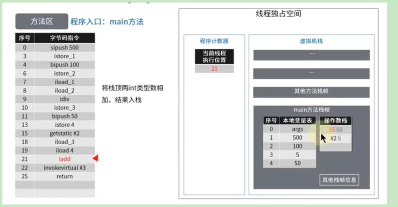
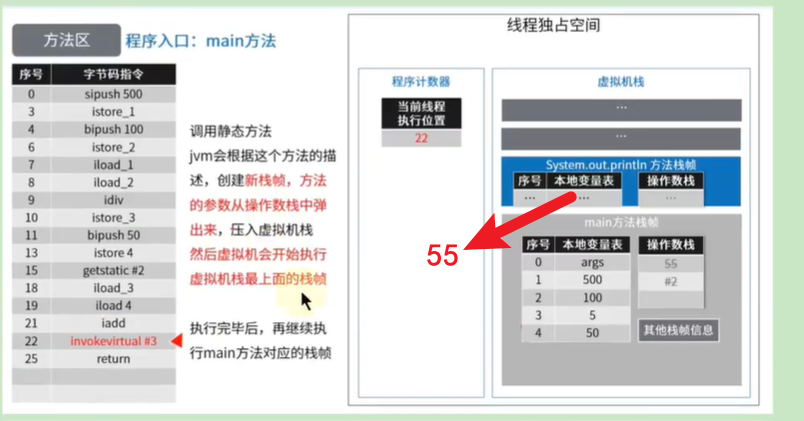


##### ++i 和i++

**不进行赋值操作时，字节码相同**

```java
//关于(前)++和(后)++
public void method6() {
    int i = 10;
    //i++;
    ++i;
}
0 bipush 10
2 istore_1
3 iinc 1 by 1
6 return
```


先load后load的问题，i++是先load的

> iinc 把**一个常量值加到一个int类型的局部变量上**

```java
public void method7() {
    int i = 10;
    int a = i++;
    int j = 20;
    int b = ++j;
}
 0 bipush 10
 2 istore_1
 3 iload_1  #先iload
 4 iinc 1 by 1
 7 istore_2
 8 bipush 20
10 istore_3
11 iinc 3 by 1
14 iload_3
15 istore 4
17 return
     
//思考
    public void method8() {
        int i = 10;
        i = i++;
        System.out.println(i); //10
    }
 0 bipush 10
 2 istore_1
 3 iload_1
 4 iinc 1 by 1
 7 istore_1
 8 getstatic #2 <java/lang/System.out : Ljava/io/PrintStream;>
11 iload_1
12 invokevirtual #5 <java/io/PrintStream.println : (I)V>
15 return

```

### 8比较指令的说明

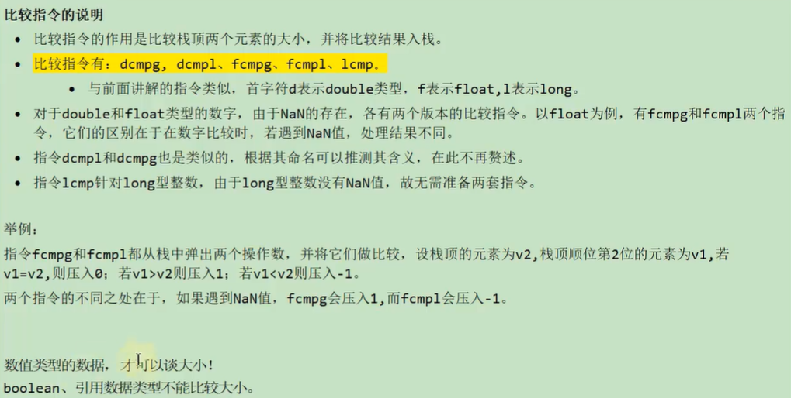

数值类型的数据，才可以谈大小!
boolean、引用数据类型不能比较大小。

注意：NaN(Not a Number)表示不是一个数字，比如0.0/0.0得到的可能是1.0（两个数相等），也可能是0.0（0.0是分子），也可能是无穷大（0.0是分母），NaN代表无法确定是什么数字，**只有double和float类型中可能出现NaN的情况**，而long类型不会出现NaN，所以只有lcmp，而没有lcml

## 4类型转换指令


类型转换指令可以将两种不同的数值类型进行相互转换。

这些转换操作一般用于实现用户代码中的**==显式类型转换操作==**，或者用来**处理字节码指令集中数据类型相关指令无法与数据类型**一一对应的问题。

**宽化类型转换**

 i2l 把int类型的数据转化为long类型

 i2f 把int类型的数据转化为float类型

 i2d 把int类型的数据转化为double类型

 l2f 把long类型的数据转化为float类型

 l2d 把long类型的数据转化为double类型

 f2d 把float类型的数据转化为double类型

 

**窄化类型转换**（强制类型转换）

 

i2b 把int类型的数据转化为byte类型

 i2c 把int类型的数据转化为char类型

 i2s 把int类型的数据转化为short类型

 l2i 把long类型的数据转化为int类型

f2i 把float类型的数据转化为int类型

 f2l 把float类型的数据转化为long类型

 d2i 把double类型的数据转化为int类型

 d2l 把double类型的数据转化为long类型

 d2f 把double类型的数据转化为float类型


**类型转换指令集**

|            | **byte** | **char** | **short** | **int** | **long** | **float** | **double** |
| ---------- | -------- | -------- | --------- | ------- | -------- | --------- | ---------- |
| **int**    | i2b      | i2c      | i2s       | ○       | i2l      | i2f       | i2d        |
| **long**   | l2i i2b  | l2i i2c  | l2i i2s   | l2i     | ○        | l2f       | l2d        |
| **float**  | f2i i2b  | f2i i2c  | f2i i2s   | f2i     | f2l      | ○         | f2d        |
| **double** | d2i i2b  | d2i i2c  | d2i i2s   | d2i     | d2l      | d2f       | ○          |


### 1宽化类型转换指令


**宽化类型转换( Widening Numeric Conversions)**


1. 转换规则


Java虚拟机直接支持以下数值的宽化类型转换（ widening numeric conversion,小范围类型向大范围类型的安全转换）。也就是说，并不需要指令执行，包括


-  从int类型到long、float或者 double类型。对应的指令为：i21、i2f、i2d 

-  从long类型到float、 double类型。对应的指令为：i2f、i2d 

-  从float类型到double类型。对应的指令为：f2d 


==简化为：int-->long-->float-> double==


1. 精度损失问题


-  宽化类型转换是不会因为超过目标类型最大值而丢失信息的，例如，从int转换到long,或者从int转换到double,都不会丢失任何信息，转换前后的值是精确相等的。 

-  **转为浮点数时，可能发生精度丢失：**从int、long类型数值转换到float，或者long类型数值转换到double时，将可能发生精度丢失一一可能**丢失掉几个最低有效位上的值**，转换后的浮点数值是根据IEEE754最接近含入模式所得到的正确整数值。 


尽管宽化类型转换实际上是可能发生精度丢失的，但是这种转换永远不会导致Java虚拟机抛出运行时异常


1. 补充说明

**从byte、char和 short类型到int类型的宽化类型转换实际上是不存在的。**对于byte类型转为int,虚拟机并没有做实质性的转化处理，只是简单地通过操作数栈交換了两个数据。而将byte转为long时，使用的是i2l,可以看到在内部，byte在这里已经等同于int类型处理，类似的还有 short类型，这种处理方式有两个特点：

一方面可以减少实际的数据类型，如果为 short和byte都准备一套指令，那么指令的数量就会大増，而**虚拟机目前的设计上，只愿意使用一个字节表示指令，因此指令总数不能超过256个，为了节省指令资源，==将 short和byte当做int处理也在情理之中。==**


另一方面，由于局部变量表中的槽位固定为32位，无论是byte或者 short存入局部变量表，都会占用32位空间。从这个角度说，也没有必要特意区分这几种数据类型。


### 2.窄化类型转换指令


**窄化类型转换( Narrowing Numeric Conversion)**

1. 转换规则  

Java虚拟机也直接支持以下窄化类型转换：

-  从主int类型至byte、 short或者char类型。对应的指令有：i2b、i2c、i2s 

-  从long类型到int类型。对应的指令有：l2i 

-  从float类型到int或者long类型。对应的指令有：f2i、f2l 

-  从double类型到int、long或者float类型。对应的指令有：d2i、d2l、d2f 

1. 精度损失问题

窄化类型转换可能会导致转换结果具备不同的正负号、不同的数量级，因此，转换过程很可能会导致数值丢失精度。

尽管数据类型窄化转换可能会发生上限溢出、下限溢出和精度丢失等情况，但是Java虚拟机规范中明确规定数值类型的窄化转换指令永远不可能导致虚拟机抛出运行时异常

> 注意：从float、double、long等类型往byte、short、char类型转换的时候，需要先把前面几种类型转换成int类型，然后在从int类型转换到后面这几种类型，所以int类型相等于一种过渡类型

1. 补充说明

当将一个浮点值窄化转换为整数类型T(T限于int或long类型之一)的时候，将遵循以下转换规则：

-  如果浮点值是NaN,那转换结果就是int或long类型的0. 

-  如果浮点值不是无穷大的话，浮点值使用IEEE754的向零含入模式取整，获得整数值v。如果v在目标类型T(int或long)的表示范围之内，那转换结果就是v。否则，将根据v的符号，转换为T所能表示的最大或者最小正数 


当将一个double类型窄化转换为float类型时，将遵循以下转换规则，通过向最接近数舍入模式舍入一个可以使用float类型表示的数字。最后结果根据下面这3条规则判断：

-  如果转换结果的绝对值太小而无法使用float来表示，将返回float类型的正负零 

-  如果转换结果的绝对值太大而无法使用float来表示，将返回float类型的正负无穷大。 

-  对于double类型的NaN值将按规定转换为float类型的NaN值。 


## 5 对象的创建与访问指令


Java是面向对象的程序设计语言，虚拟机平台从字节码层面就对面向对象做了深层次的支持。有一系列指令专门用于对象操作，可进一步细分为创建指令、字段访问指令、数组操作指令、类型检查指令。

**对象操作指令**

 new 创建一个新对象

getfield 从对象中获取字段

 putfield 设置对象中字段的值

 getstatic 从类中获取静态字段

 putstatic 设置类中静态字段的值

 checkcast 确定对象为所给定的类型。后跟目标类，判断栈顶元素是否为目标类 / 接口的实例。如果不是便抛出异常

 instanceof 判断对象是否为给定的类型。后跟目标类，判断栈顶元素是否为目标类 / 接口的实例。是则压入 1，否则压入 0

 

**数组操作指令**

 

newarray 分配数据成员类型为基本上数据类型的新数组

 anewarray 分配数据成员类型为引用类型的新数组

 arraylength 获取数组长度

 multianewarray 分配新的多维数组


### 1创建指令

| 创建指令       | 含义             |
| -------------- | ---------------- |
| new            | 创建类实例       |
| newarray       | 创建基本类型数组 |
| anewarray      | 创建引用类型数组 |
| multilanewarra | 创建多维数组     |


虽然类实例和数组都是对象，但Java虚拟机对类实例和数组的创建与操作使用了不同的字节码指令：


1. 创建类实例的指令： 

- - ==创建类实例的指令：new==

- - 它接收一个操作数，为指向常量池的索引，表示要创建的类型，执行完成后，将对象的引用压入栈。

 

1. 创建数组的指令： 

- - **创建数组的指令：newarray、anewarray、multianewarray**

- - 上述创建指令可以用于创建对象或者数组，由于对象和数组在Java中的广泛使用，这些指令的使用频率也非常高。


```java
//1.创建指令
public void newInstance() {
    Object obj = new Object();
    File file = new File("atguigu.avi");
}

 0 new #2 <java/lang/Object>
 3 dup 
 4 invokespecial #1 <java/lang/Object.<init> : ()V>
 7 astore_1
 8 new #3 <java/io/File>
11 dup
12 ldc #4 <atguigu.avi>
14 invokespecial #5 <java/io/File.<init> : (Ljava/lang/String;)V>
17 astore_2
18 return
```

**为什么要dup 复制一份？**

因为invokespecial(<init>方法)会消耗一份，astore_1也需要消耗一份。

注: 通常说的栈中存对象引用指向堆中的对象地址，**==是指栈中的局部变量表里存储的对象引用。==**

### 2 字段访问指令

| 字段访问指令         | 含义                                                   |
| -------------------- | ------------------------------------------------------ |
| getstatic、putstatic | 访问类字段（static字段，或者称为类变量）的指令         |
| getfield、 putfield  | 访问类实例字段（非static字段，或者称为实例变量）的指令 |


对象创建后，就可以通过对象访问指令获取对象实例或数组实例中的字段或者数组元素。


- ==访问类字段（static字段，或者称为类变量）的指令：getstatic、putstatic==

- ==访问类实例字段（非static字段，或者称为实例变量）的指令：getfield、putfield==


举例：以getstatic指令为例，它含有一个操作数，为指向常量池的Fieldref索引，它的作用就是获取Fieldref指定的对象或者值，并将其压入操作数栈。


```java
public void sayHello() {
    System.out.println("hel1o"); 
}
```


对应的字节码指令：


```shell
0 getstatic #8 <java/lang/System.out>
3 ldc #9 <hello>
5 invokevirtual #10 <java/io/PrintStream.println>
8 return
```


图示：


### 3数组操作指令


数组操作指令主要有：xastore和xaload指令。具体为：


- 把一个数组元素加载到操作数栈的指令：baload、caload、saload、iaload、laload、faload、daload、aaload

- 将一个操作数栈的值存储到数组元素中的指令：bastore、castore、sastore、iastore、lastore、fastore、dastore、aastore

| 数组指令    | byte(boolean) | char    | short   | long    | long    | float   | double  | reference |
| ----------- | ------------- | ------- | ------- | ------- | ------- | ------- | ------- | --------- |
| **xaload**  | baload        | caload  | saload  | iaload  | laload  | faload  | daload  | aaload    |
| **xastore** | bastore       | castore | sastore | iastore | lastore | fastore | dastore | aastore   |


取数组长度的指令：arraylength。该指令弹出栈顶的数组元素，获取数组的长度，将长度压入栈。


指令xaload表示将数组的元素压栈，比如saload、caload分别表示压入short数组和char数组。指令xaload在执行时，要求操作数中栈顶元素为数组索引i，栈顶顺位第2个元素为数组引用a，该指令会弹出栈顶这两个元素，并将a[i]重新压入栈。


xastore则专门针对数组操作，以iastore为例，它用于给一个int数组的给定索引赋值。在iastore执行前，操作数栈顶需要以此准备3个元素：值、索引、数组引用，iastore会弹出这3个值，并将值赋给数组中指定索引的位置。


### 4类型检查指令


检查类实例或数组类型的指令：instanceof、checkcast。

- 指令instanceof用来判断给定对象是否是某一个类的实例，它会将判断结果压入操作数栈
- 指令checkcast用于检查类型强制转换是否可以进行。如果可以进行，那么checkcast指令不会改变操作数栈，否则它会抛出ClassCastException异常

| 类型检查指令 | 含义                             |
| ------------ | -------------------------------- |
| instanceof   | 判断给定对象是否是某一个类的实例 |
| checkcast    | 检查类型强制转换是否可以进行     |


## 6方法调用与返回指令


**方法调用指令**

invokcvirtual 运行时按照对象的类来调用实例方法

invokespecial 根据编译时类型来调用实例方法 

invokestatic 调用类（静态）方法

invokcinterface 调用接口方法

 

**方法返回指令**

ireturn 从方法中返回int类型的数据

lreturn 从方法中返回long类型的数据

freturn 从方法中返回float类型的数据

dreturn 从方法中返回double类型的数据

areturn 从方法中返回引用类型的数据 

return 从方法中返回，返回值为void


### 1方法调用指令


方法调用指令：invokevirtual、invokeinterface、invokespecial、invokestatic、invokedynamic，以下5条指令用于方法调用：


- invokevirtual指令用于调用对象的实例方法，根据对象的实际类型进行分派（虚方法分派），支持多态。这也是Java语言中**最常见的方法分派方式。**

- invokeinterface指令用于**调用接口方法**，它会在运行时搜索由特定对象所实现的这个接口方法，并找出适合的方法进行调用。

- invokespecial指令用于调用一些需要特殊处理的实例方法，包括**实例初始化方法（构造器）、私有方法和父类方法**。这些方法都是==静态类型绑定==的，不会在调用时进行动态派发。

- invokestatic指令用于调用命名**类中的类方法（static方法）**。这是==静态绑定==的。

- invokedynamic指令用于调用动态绑定的方法，这个是JDK1.7后新加入的指令。用于在运行时动态解析出调用点限定符所引用的方法，并执行该方法。

- invokedynamic指令的分派逻辑是由用户所设定的引导方法决定的，而前面4条调用指令的分派逻辑都固化在java虚拟机内部。

注意：
1、invokedynamic老师不讲，估计是很少遇到吧
2、invokeinterface是对接口而言的，用属于接口类型的对象调用方法的时候就是这个
3、invokespecial只有构造器、私有方法、super.方法名()调用父类方法这几种情况，其中调用父类方法这种情况可能出现其直接父类没有该方法，那就可以调用其父类继承的父类中的该方法，最终找到一个方法调用就是了

| 方法调用指令    | 含义                                                         |
| --------------- | ------------------------------------------------------------ |
| invokevirtual   | 调用对象的实例方法                                           |
| invokeinterface | 调用接口方法                                                 |
| invokespecial   | 调用一些需要特殊处理的实例方法，包括实例初始化方法（构造器）、私有方法和父类方法 |
| invokestatic    | 调用命名类中的类方法（static方法）                           |
| invokedynamic   | 调用动态绑定的方法                                           |


### 2方法返回指令


方法调用结束前，需要进行返回。方法返回指令是**根据返回值的类型区分**的。

- 包括ireturn（当返回值是boolean、byte、char、short和int 类型时使用）、lreturn、freturn、dreturn和areturn

- 另外还有一条return 指令供声明为void的方法、实例初始化方法以及类和接口的类初始化方法使用。

| 方法返回指令 | void   | int     | long    | float   | double  | reference |
| ------------ | ------ | ------- | ------- | ------- | ------- | --------- |
| **xreturn**  | return | ireturn | lreturn | freutrn | dreturn | areturn   |

通过ireturn指令，**将当前函数操作数栈的顶层元素弹出，并将这个元素压入调用者函数的操作数栈中**（因为调用者非常关心函数的返回值），所有在当前函数操作数栈中的其他元素都会被丢弃。

如果当前返回的是synchronized方法，那么还会执行一个隐含的monitorexit指令，退出临界区。

最后，会丢弃当前方法的整个帧，恢复调用者的帧，并将控制权转交给调用者。

举例：

```java
public int methodReturn() {
    int i = 500;
    int j = 200;
    int k = 50;
    
    return (i + j) / k;
}
```

图示：


------

## 7操作数栈管理指令


如同操作一个普通数据结构中的堆栈那样，JVM提供的操作数栈管理指令，可以用于直接操作操作数栈的指令。

这类指令包括如下内容：

- 将一个或两个元素从栈顶弹出，并且直接废弃：`pop，pop2`

- 复制栈顶一个或两个数值并将复制值或双份的复制值重新压入栈顶：`dup，dup2，dup_x1，dup2_×1，dup_×2，dup2_×2`

- 将栈最顶端的两个Slot数值位置交换：`swap`。Java虚拟机没有提供交换两个64位数据类型（long、double）数值的指令。

- 指令`nop`，是一个非常特殊的指令，它的字节码为0x00。和汇编语言中的nop一样，它表示什么都不做。这条指令一般可用于调试、占位等。

这些指令属于通用型，对栈的压入或者弹出无需指明数据类型。

- 不带_x的指令是复制栈顶数据并压入栈顶。包括两个指令，`dup，dup2`。dup的系数代表要复制的Slot个数。dup开头的指令用于复制1个Slot的数据。例如1个int或1个reference类型数据dup2开头的指令用于复制2个Slot的数据。例如1个long，或2个int，或1个int+1个float类型数据

- 带_x的指令是复制栈顶数据并插入栈顶以下的某个位置。共有4个指令，`dup_×1，dup2_×1，dup_×2，dup2×2`。对于带*x的复制插入指令，只要将指令的dup和x的系数相加，结果即为需要插入的位置。因此dup*×1插入位置：1+1=2，即栈顶2个slot下面dup_×2插入位置：1+2=3，即栈顶3个slot下面；dup2×1插入位置：2+1=3，即栈顶3个Slot下面

- pop：将栈顶的1个Slot数值出栈。例如1个short类型数值

- pop2：将栈顶的2个slot数值出栈。例如1个double类型数值，或者2个int类型数值


**通用(无类型）栈操作**

 

nop 不做任何操作

pop 弹出栈顶端一个字长的内容

pop2 弹出栈顶端两个字长的内容

dup 复制栈顶部一个字长内容

dup_x1 复制栈顶部一个字长的内容，然后将复制内容及原来弹出的两个字长的内容压入栈

 dup_x2 复制栈顶部一个字长的内容，然后将复制内容及原来弹出的三个字长的内容压入栈

 dup2 复制栈顶部两个字长内容

 dup2_x1 复制栈顶部两个字长的内容，然后将复制内容及原来弹出的三个字长的内容压入栈

 dup2_x2 复制栈顶部两个字长的内容，然后将复制内容及原来弹出的四个字长的内容压入栈

swap 交换栈顶部两个字长内容


### 举例

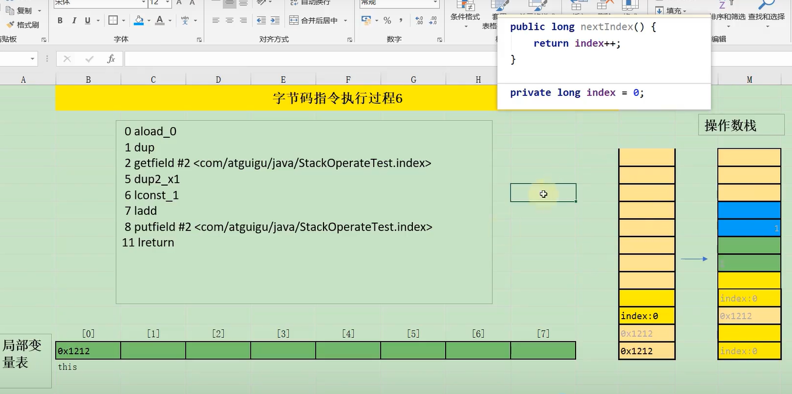

## 8控制转移指令

程序流程离不开条件控制，为了支持条件跳转，虚拟机提供了大量字节码指令，大体上可以分为

1. ）比较指令、
2. 条件跳转指令、
3. 比较条件跳转指令、
4. 多条件分支跳转指令、
5. 无条件跳转指令等。

**比较指令**

 lcmp 比较long类型值

 fcmpl 比较float类型值（当遇到NaN时，返回-1）

 fcmpg 比较float类型值（当遇到NaN时，返回1）

 dcmpl 比较double类型值（当遇到NaN时，返回-1）

 dcmpg 比较double类型值（当遇到NaN时，返回1）

 **条件跳转指令**

 ifeq 如果等于0，则跳转

ifne 如果不等于0，则跳转

 iflt 如果小于0，则跳转

 ifge 如果大于等于0，则跳转

 ifgt 如果大于0，则跳转

 ifle 如果小于等于0，则跳转

 

**比较条件分支指令**

 

if_icmpeq 如果两个int值相等，则跳转

 if_icmpne 如果两个int类型值不相等，则跳转

 if_icmplt 如果一个int类型值小于另外一个int类型值，则跳转

 if_icmpge 如果一个int类型值大于或者等于另外一个int类型值，则跳转

 if_icmpgt 如果一个int类型值大于另外一个int类型值，则跳转

 if_icmple 如果一个int类型值小于或者等于另外一个int类型值，则跳转

 ifnull 如果等于null，则跳转

 ifnonnull 如果不等于null，则跳转

 if_acmpeq 如果两个对象引用相等，则跳转

 if_acmpne 如果两个对象引用不相等，则跳转

 

**多条件分支跳转指令**

 

tableswitch 通过索引访问跳转表，并跳转

 lookupswitch 通过键值匹配访问跳转表，并执行跳转操作

 

**无条件跳转指令**

 

goto 无条件跳转

 goto_w 无条件跳转（宽索引）


### 1比较指令


比较指令的作用是比较占栈顶两个元素的大小，并将比较结果入栈。==比较指令有： dcmpg,dcmpl、 fcmpg、fcmpl、lcmp。==与前面讲解的指令类似，首字符d表示double类型，f表示float,l表示long。

对于double和float类型的数字，由于NaN的存在，各有两个版本的比较指令。以float为例，有fcmpg和fcmpl两个指令，它们的区别在于在数字比较时，若遇到NaN值，处理结果不同。

指令dcmpl和 dcmpg也是类似的，根据其命名可以推测其含义，在此不再赘述。

**数值类型的数据，才可以谈大小！boolean、引用数据类型不能比较大小。**

**举例**

指令 fcmp和fcmpl都从中弹出两个操作数，并将它们做比较，设栈顶的元素为v2，顶顺位第2位的元素为v1：若v1=v2，则压入0；若v1>v2，则压入1；若v1<v2，则压入-1。

两个指令的不同之处在于，如果遇到NaN值， fcmpg会压入1,而fcmpl会压入-1

### 2条件跳转指令

条件跳转指令通常和比较指令结合使用。在条件跳转指令执行前，一般可以先用比较指令进行栈顶元素的准备，然后进行条件跳转。

条件跳转指令有：ifeq，iflt，ifle，ifne，ifgt，ifge，ifnull，ifnonnull。这些指令都接收两个字节的操作数，用于计算跳转的位置（16位符号整数作为当前位置的offset）。

它们的统一含义为：**弹出栈顶元素，测试它是否满足某一条件，如果满足条件，则跳转到给定位置。**

lt(less than)｜greater than

| <    | <=   | ==   | !=   | >=   | >    | null   | not null  |
| ---- | ---- | ---- | ---- | ---- | ---- | ------ | --------- |
| iflt | ifle | ifeq | ifng | ifge | ifgt | ifnull | ifnonnull |


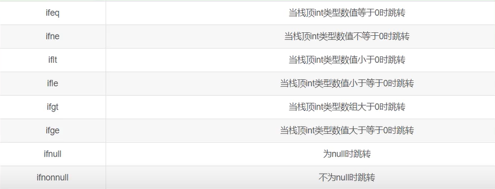


与前面运算规则一致：

- 对于boolean、byte、char、short类型的条件分支比较操作，都是使用int类型的比较指令完成

- 对于long、float、double类型的条件分支比较操作，则会先执行相应类型的比较运算指令，运算指令会返回一个整型值到操作数栈中，随后再执行int类型的条件分支比较操作来完成整个分支跳转

由于各类型的比较最终都会转为int类型的比较操作，所以Java虚拟机提供的int类型的条件分支指令是最为丰富和强大的。

### 3 比较条件跳转指令

比较条件跳转指令类似于比较指令和条件跳转指令的结合体，它将比较和跳转两个步骤合二为一。

这类指令有：==if_icmpeq、if_icmpne、if_icmplt、if_icmpgt、if_icmple、if_icmpge、if_acmpeq和if_acmpne==。其中指令助记符加上“if_”后，以字符“i”开头的指令针对it型整数操作（也包括short和byte类型），以字符“a”开头的指令表示对象引用的比较。

| <         | <=        | ==                   | !=                   | >=        | >         |
| --------- | --------- | -------------------- | -------------------- | --------- | --------- |
| if_icmplt | if_icmple | if_icmpeq、if_acmpeq | if_icmpne、if_acmpne | if_icmpge | if_icmpgt |


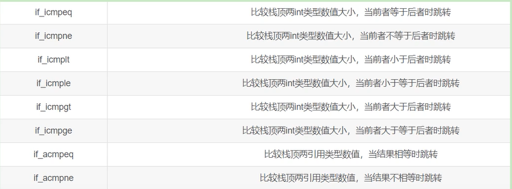


这些指令都接收两个字节的操作数作为参数，用于计算跳转的位置。同时在执行指令时，栈顶需要准备两个元素进行比较。指令执行完成后，栈顶的这两个元素被清空，且没有任何数据入栈。**如果预设条件成立，则执行跳转，否则，继续执行下一条语句。**

### 4多条件分支跳转指令

多条件分支跳转指令是专为switch-case语句设计的，主要有tableswitch和lookupswitch。

| 指令名称     | 描述                             |
| ------------ | -------------------------------- |
| tableswitch  | 用于switch条件跳转，case值连续   |
| lookupswitch | 用于switch条件跳转，case值不连续 |

从助记符上看，两者都是switch语句的实现，它们的区别：

- tableswitch要求多个条件分支值是连续的，它内部只存放起始值和终止值，以及若干个跳转偏移量，通过给定的操作数index，可以立即定位到跳转偏移量位置，因此效率比较高。

- lookupswitch内部存放着各个离散的case-offset对，每次执行都要搜索全部的case-offset对，找到匹配的case值，并根据对应的offset计算跳转地址，因此效率较低。

指令tableswitch的示意图如下图所示。由于tableswitch的case值是连续的，因此只需要记录最低值和最高值，以及每一项对应的offset偏移量，根据给定的index值通过简单的计算即可直接定位到offset。


指令lookupswitch处理的是离散的case值，但是出于效率考虑，将**case-offset对按照case值大小排序，**给定index时，需要查找与index相等的case，获得其offset，如果找不到则跳转到default。指令lookupswitch如下图所示。

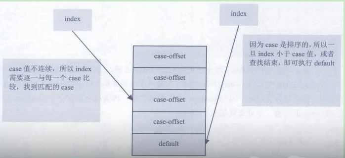


#### 举例

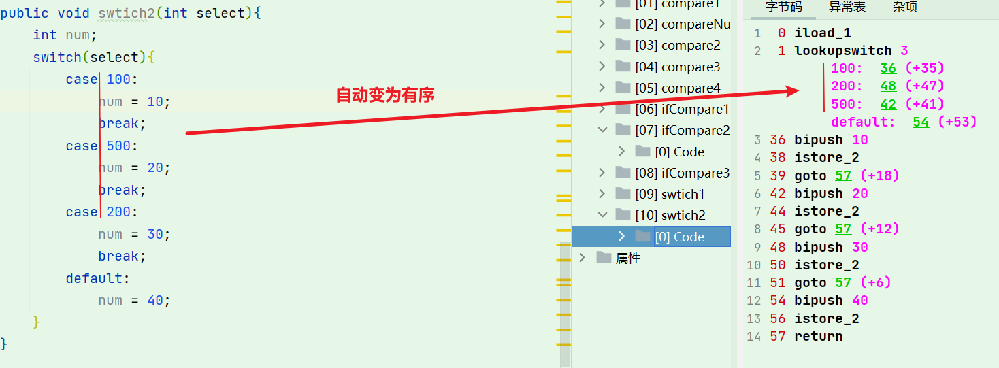


### 5无条件跳转指令

目前主要的无条件跳转指令为goto。指令goto接收两个字节的操作数，共同组成一个带符号的整数，**用于指定指令的偏移量，指令执行的目的就是跳转到偏移量给定的位置处。**

如果指令偏移量太大，超过双字节的带符号整数的范围，则可以使用指令goto_w，它和goto有相同的作用，但是它接收4个字节的操作数，可以表示更大的地址范围。

指令jsr、jsr_w、ret虽然也是无条件跳转的，但主要用于try-finally语句，且已经被虚拟机逐渐废弃，故不在这里介绍这两个指令。

| 指令名称 | 描述                                                         |
| -------- | ------------------------------------------------------------ |
| goto     | 无条件跳转                                                   |
| goto_w   | 无条件跳转（宽索引）                                         |
| jsr      | 跳转至指定16位offset位置，并将jsr下一条指令地址压入栈顶      |
| jsr_w    | 跳转至指定32位offer位置，并将jsr_w下一条指令地址压入栈顶     |
| ret      | 返回至由指定的局部变量所给出的指令位置（一般与jsr、jsr_w联合使用） |

举例：

```java
//思考:如下两个方法的操作有何不同?
    public void whileTest() {
        int i = 1;
        while (i <= 100) {
            i++;
        }
        //可以继续使用i

    }

    public void forTest() {
        for (int i = 1; i <= 100; i++) {
        }
        //不可以继续使用i

    }
//字节码指令都是一样的
0 iconst_1
1 istore_1
2 iload_1
3 bipush 100
5 if_icmpgt 14 (+9)
8 iinc 1 by 1
11 goto 2 (-9)
14 return
    
    //更进--步.
    public void doWhileTest() {
        int i = 1;
        do {
            i++;
        } while (i <= 100);
    }
 0 iconst_1
 1 istore_1
 2 iinc 1 by 1
 5 iload_1
 6 bipush 100
 8 if_icmple 2 (-6)
11 return
```

## 9异常处理指令

异常及异常的处理:

过程:异常对象的生成过程---> throw (手动/自动)-----==-指令:athrow==
		过程二:异常的处理:抓抛模型。try-catch- finally ----==使用异常表==


**异常处理指令**

 athrow 抛出异常或错误。将栈顶异常抛出

 jsr 跳转到子例程

 sr_w 跳转到子例程（宽索引）

 ret 从子例程返回

### 1抛出异常指令

**athrow指令**

在Java程序中显示抛出异常的操作（throw语句）都是由athrow指令来实现。

除了使用throw语句显示抛出异常情况之外，**JVM规范还规定了许多运行时异常会在其他Java虚拟机指令检测到异常状况时自动抛出**。例如，在之前介绍的整数运算时，当除数为零时，虚拟机会在idiv或ldiv指令中抛出ArithmeticException异常。

正常情况下，操作数栈的压入弹出都是一条条指令完成的。唯一的例外情况是**在抛异常时，Java虚拟机会清除操作数栈上的所有内容，而后将异常实例压入调用者操作数栈上。**

注意：
如果使用throw new 异常名称()这种形式来抛出异常，那就会在代码中出现athrow指令，而在方法上面添加throw 异常名称这种形式来抛出异常，然后使用jclasslib的时候就会出现在方法下面多出现一个属性Exceptions，如下图所示：


### 2异常处理与异常表

**处理异常**

在Java虚拟机中，**处理异常**（catch语句）不是由字节码指令来实现的（早期使用jsr、ret指令），而是**采用异常表来完成的**。

**异常表**

如果一个方法定义了一个try-catch 或者try-finally的异常处理，就会创建一个异常表。它包含了每个异常处理或者finally块的信息。异常表保存了每个异常处理信息。比如：

- 起始位置

- 结束位置

- 程序计数器记录的代码处理的偏移地址

- 被捕获的异常类在常量池中的索引

**当一个异常被抛出时，JVM会在当前的方法里寻找一个匹配的处理，如果没有找到，这个方法会强制结束并弹出当前栈帧**，并且异常会重新抛给上层调用的方法（在调用方法栈帧）。如果在所有栈帧弹出前仍然没有找到合适的异常处理，这个线程将终止。如果这个异常在最后一个非守护线程里抛出，将会导致JVM自己终止，比如这个线程是个main线程。

**不管什么时候抛出异常，如果异常处理最终匹配了所有异常类型，代码就会继续执行。**在这种情况下，如果方法结束后没有抛出异常，仍然执行finally块，在return前，它直接跳到finally块来完成目标

```java
//思考:如下方法返回结果为多少?
public static String func() {
    String str = "hello";
    try {
        return str;
    } finally {
        str = "atguigu";
    }
}

public static void main(String[] args) {
    System.out.println(func());//hello
}
```

在finally执行前return的值已经决定好的，开发者这么设计的原因应该是为了让try catch finally结构尽量只跟异常有关

这里总结一下：**try-catch-finally 中的return返回值**，采取就近原则，**如果在执行finally之前遇到了return，那么在finally中修改之前return返回的变量，将不会生效**

## 10同步控制指令

Java虚拟机支持两种同步结构：**方法级的同步**和**方法内部一段指令序列的同步**，这两种同步都是使用monitor来支持的

### 2.10.1. 方法级的同步

方法级的同步：==**是隐式的**==，即无须通过字节码指令来控制，它实现在方法调用和返回操作之中。虚拟机可以从方法常量池的方法表结构中的ACC_SYNCHRONIZED访问标志得知一个方法是否声明为同步方法；

当调用方法时，调用指令将会检查方法的ACC_SYNCHRONIZED访问标志是否设置。

- 如果设置了，执行线程将先持有同步锁，然后执行方法。**最后**在方法完成（无论是正常完成还是非正常完成）时**释放同步锁**。

- 在方法执行期间，执行线程持有了同步锁，其他任何线程都无法再获得同一个锁。

- 如果一个同步方法执行期间抛出了异常，并且在方法内部无法处理此异常，那这个同步方法所持有的锁将在异常抛到同步方法之外时自动释放。

举例：

```java
private int i = 0;
public synchronized void add() {
	i++;
}
```

对应的字节码：

```shell
0  aload_0
1  dup
2  getfield #2 <com/atguigu/java1/SynchronizedTest.i>
5  iconst_1 
6  iadd
7  putfield #2 <com/atguigu/java1/SynchronizedTest.i>
10 return
```

这段代码和普通的无同步操作的代码没有什么不同，没有使用monitorenter和monitorexit进行同步区控制。

这是因为，对于同步方法而言，当**虚拟机通过方法的访问标示符判断是一个同步方法时，会自动在方法调用前进行加锁**，当同步方法执行完毕后，不管方法是正常结束还是有异常抛出，均会由虚拟机释放这个锁。

因此，对于同步方法而言，monitorenter和monitorexit指令是隐式存在的，并未直接出现在字节码中。

### 2方法内指令指令序列的同步

同步一段指令集序列：通常是由java中的synchronized语句块来表示的。jvm的指令集有monitorenter和monitorexit 两条指令来支持synchronized关键字的语义。

当一个线程进入同步代码块时，它使用monitorenter指令请求进入。如果当前对象的监视器计数器为0，则它会被准许进入，若为1，则判断持有当前监视器的线程是否为自己，如果是，则进入，否则进行等待，直到对象的监视器计数器为0，才会被允许进入同步块。

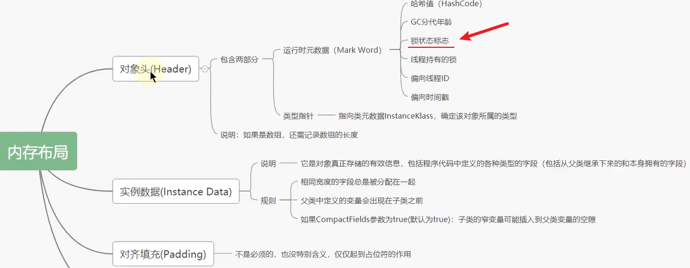

当线程退出同步块时，需要使用monitorexit声明退出。在Java虚拟机中，任何对象都有一个监视器与之相关联，用来判断对象是否被锁定，当监视器被持有后，对象处于锁定状态。

指令monitorenter和monitorexit在执行时，都需要在操作数栈顶压入对象，之后monitorenter和monitorexit的锁定和释放都是针对这个对象的监视器进行的。

下图展示了监视器如何保护临界区代码不同时被多个线程访问，只有当线程4离开临界区后，线程1、2、3才有可能进入。

对应的字节码：

```shell
 0: aloade
 1: dup
 2: astore_1
 3: monitorenter
 4: aload_0
 5: dup
 6: getfield #2 //Field i:I
 9: iconst_1
10: isub
11: putfield #2 //Field i:I
14: aload_1
15: monitorexit
16: goto 24
19: astore_2
26: aload_1
21: monitorexit
22: aload_2
23: athrow
24: return

Exception table:
	from to target type
	4	 16	   19  any
	19	 22    19  any
```

编译器必须确保无论方法通过何种方式完成，方法中调用过的每条monitorenter指令都必须执行其对应的monitorexit指令，而无论这个方法是正常结束还是异常结束。

为了保证在方法异常完成时monitorenter和monitorexit指令依然可以正确配对执行，**编译器会自动产生一个异常处理器，这个异常处理器声明可处理所有的异常，它的目的就是用来执行monitorexit指令** 

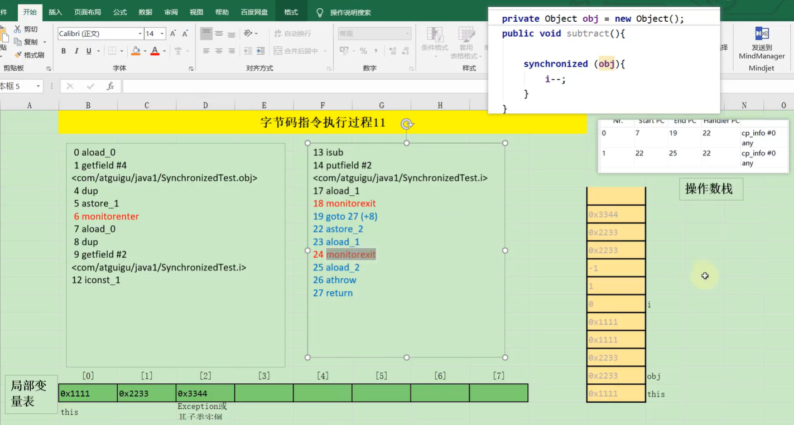

操作数栈中的对象和monitorenter结合起来可以让线程获取锁，做法就是让对象的监视器标记从0变成1，这就代表该线程上锁了，然后在操作数栈的aload_1和monitorexit结合起来就可以让线程解锁，做法就是让对象的监视器标记从1变成0，这个解锁需要在方法退出之前完成，**如果方法执行过程中出现了任何异常，将会跳到异常处理的字节码处执行相关代码**，如果**异常处理的字节码部分出现了问题，那就重新执行异常处理的字节码**，这些内容都在异常表中写的很明确，其中异常表也在上面截图中