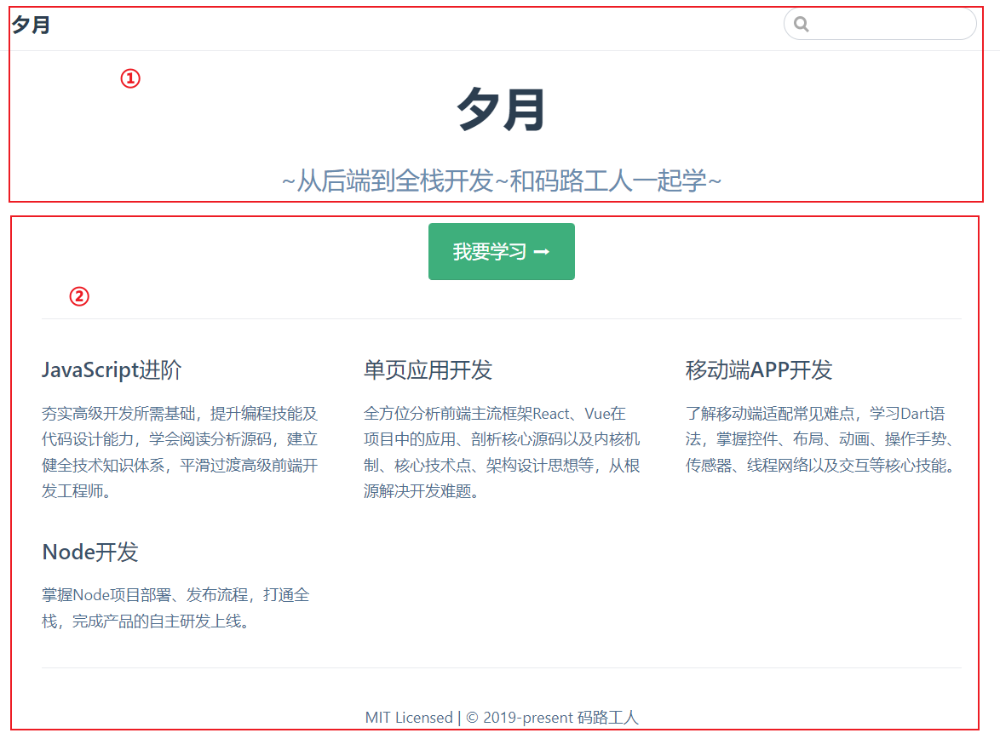
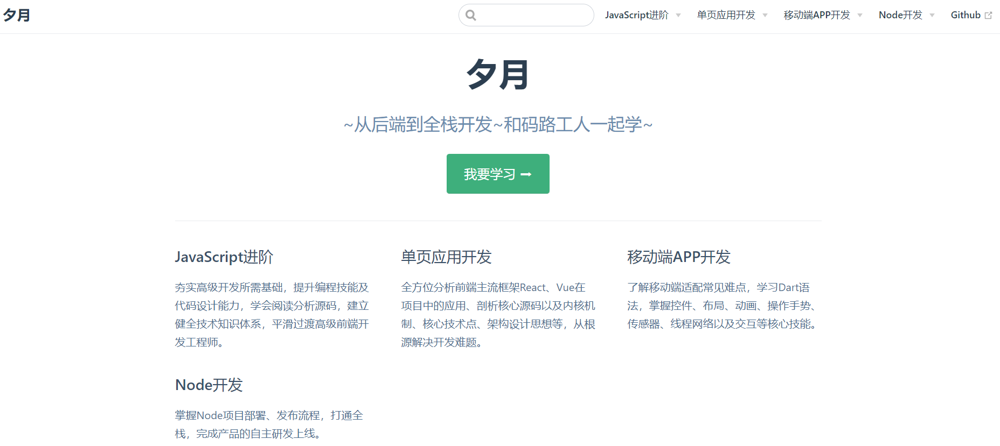
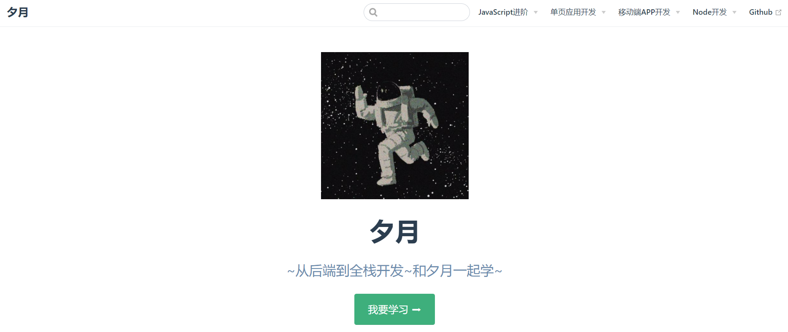
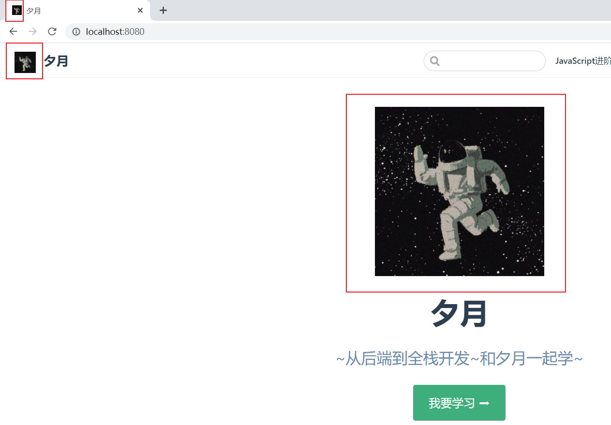
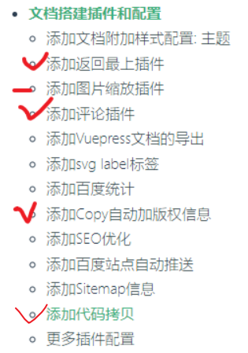
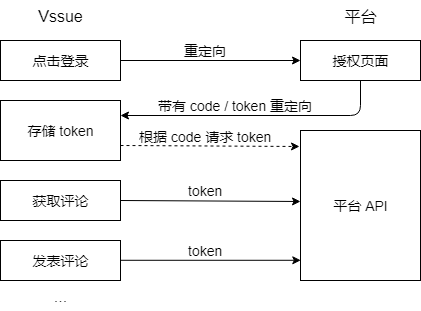
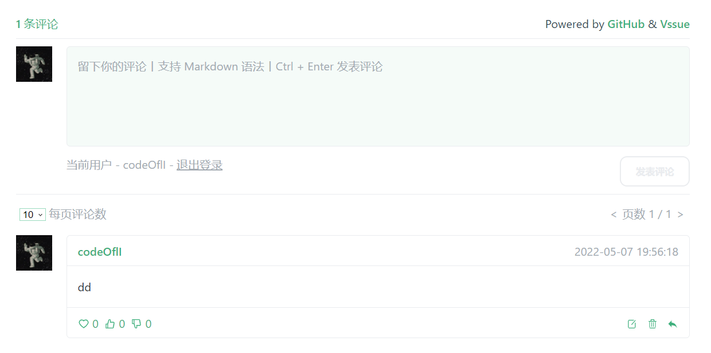
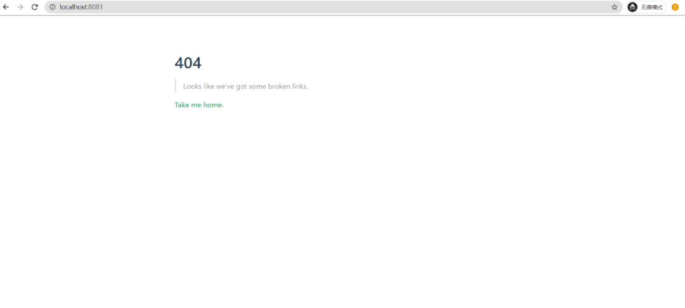
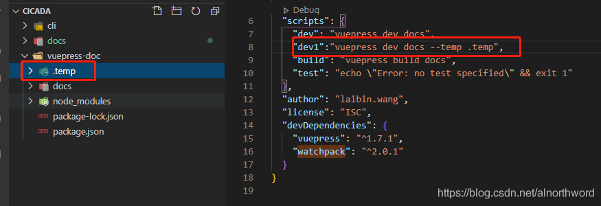

# 使用 VuePress 搭建个人博客

> VuePress是一个基于 Vue 的静态网站生成器。其中主要用到：Vue，VueRouter，Webpack。
> 类似的工具：hexo

- 基于 Markdown 语法生成网页
- 可以使用 Vue 开发的组件

使用 VuePress 搭建个人博客：

- 创建远程仓库
- 本地博客项目搭建
- 其它

## 本地博客项目搭建

```
#初始化工程目录 v-blog
npm init -y
```

npm初始化项目,会生成package.json文件。

## 目录配置

极简基本结构：

```
.
├─ docs
│  ├─ README.md
│  └─ .vuepress
│     └─ config.js
└─ package.json
```


/v-blog/

新建docs文件夹（在根目录 v-blog 下），这里存放所有的博客内容。

```
mkdir docs
```

/v-blog/docs/

docs文件夹下新建README.md，这个文件就是首页。

docs文件夹下新建`.vuepress`文件夹，该目录存放vuepress的所有配置。

/v-blog/docs/.vuepress/

.vuepress文件夹下，新建config.js文件，**作为vuepress的配置入口文件**。

当内容多时，config.js中的配置项可以抽出单独的 js 文件。

以上，最基本的结构就完成了，让我们生成个主页试试。

生成简单主页

```
/v-blog/docs/.vuepress/config.js
```

在 config.js 中编辑如下：

```js
module.exports = {
    title: '夕月',
    description: '~从后端到全栈开发~和夕月一起学~'
}
```

```
/v-blog/docs/README.md
```

在 README.md 文件中编辑如下：

```markdown
---
home: true
heroImage: /img/logo.png
actionText: 我要学习 ➡
actionLink: /senior-js/
features:
- title: JavaScript进阶
  details: 夯实高级开发所需基础，提升编程技能及代码设计能力，学会阅读分析源码，建立健全技术知识体系，平滑过渡高级前端开发工程师。
- title: 单页应用开发
  details: 全方位分析前端主流框架React、Vue在项目中的应用、剖析核心源码以及内核机制、核心技术点、架构设计思想等，从根源解决开发难题。
- title: 移动端APP开发
  details: 了解移动端适配常见难点，学习Dart语法，掌握控件、布局、动画、操作手势、传感器、线程网络以及交互等核心技能。
- title: Node开发
  details: 掌握Node项目部署、发布流程，打通全栈，完成产品的自主研发上线。
footer: MIT Licensed | © 2019-present 夕月
---
```

#### 启动起来：

```
vuepress dev docs
```


或者在 package.json 文件里配置一个命令：

```js
"scripts" :{
    "start": "vuepress dev docs"
}
```


就可以用以下命令启动：

就可以用以下命令启动：

```bash
npm run start
# 或
npm start

```

config.js 中的配置对应下图中的 ①

README.md 中的配置对应下图中的 ②



好了，简单主页出来了。下面我们要添加的是Navbar导航栏以及sidebar侧边栏。

### Navbar 导航栏

编辑/v-blog/docs/.vuepress/config.js文件，配置`themeConfig.nav`。

```js
module.exports = {
    title: '夕月',
    description: '~从后端到全栈开发~和码路工人一起学~',
    themeConfig: {
        nav: [
            {
                text: 'JavaScript进阶',
                items: [
                    {text: '框架的设计 jQuery源码分析', link: '/senior-js/jquery/'},
                    {text: '函数式编程 Underscore源码分析', link: '/senior-js/underscore/'},
                    {text: '模块化编程 自研模块加载器', link: '/senior-js/module/'},
                ]
            },
            {
                text: '单页应用开发',
                items: [
                    {text: '组件化开发 React专题', link: '/spa/react/'},
                    {text: '组件化开发 Vue专题', link: '/spa/vue/'},
                    {text: '现代前端工程实践方案 解锁webpack', link: '/spa/webpack/'},
                ]
            },
            {
                text: 'Github',
                link: 'https://github.com/CoderMonkie/v-blog'
            },
        ]
    }
}
```


- **导航栏里面链接条目可以嵌套（层级可设）**
- 内部链接两头斜线：link: '/route-path-here/'
- 外部链接直接填上网址，如上面的 Github
  结果图：
- 

> 我们在上面添加了若干链接，还没有写具体文章，所以还不能跳转。
> 当条目越来越多，文件也越来越长，就有必要分出单独文件来管理了。

我们在config.js同级目录下新建一个nav.js，themeConfig.nav的值直接引入nav.js文件。

```
/v-blog/docs/.vuepress/config.js
```

就变成以下：

```
module.exports = {
  title: '夕月',
    description: '~从后端到全栈开发~和码路工人一起学~',
  themeConfig: {
    nav: require('./nav')
  }
}
```


​		把刚才上面的导航配置复制粘贴到`nav.js`文件中。

/v-blog/docs/.vuepress/nav.js 文件编辑如下：

```js
module.exports = [
    {
        text: 'JavaScript进阶',
        items: [
          {text: '框架的设计 jQuery源码分析', link: '/senior-js/jquery/'},
          {text: '函数式编程 Underscore源码分析', link: '/senior-js/underscore/'},
          {text: '模块化编程 自研模块加载器', link: '/senior-js/module/'},
        ]
      },
      {
        text: '单页应用开发',
        items: [
          {text: '组件化开发 React专题', link: '/spa/react/'},
          {text: '组件化开发 Vue专题', link: '/spa/vue/'},
          {text: '现代前端工程实践方案 解锁webpack', link: '/spa/webpack/'},
        ]
      },
      {
        text: '移动端APP开发',
        items: [
          {text: 'TODO-1', link: '/mobile/TODO1/'},
          {text: 'TODO-2', link: '/mobile/TODO2/'},
          {text: 'TODO-3', link: '/mobile/TODO3/'},
        ]
      },
      {
        text: 'Node开发',
        items: [
            {text: 'TODO-1', link: '/node/TODO1/'},
            {text: 'TODO-2', link: '/node/TODO2/'},
            {text: 'TODO-3', link: '/node/TODO3/'},
        ]
      },
      {
        text: 'Github',
        link: 'https://github.com/CoderMonkie/v-blog'
      },
]
```


这样，config.js配置文件就简洁了。

下面在配置侧边栏时，我们直接采用同样的方法，
不再把具体配置写在config.js中了。

### Sidebar 侧边栏

编辑/v-blog/docs/.vuepress/config.js文件，配置themeConfig.sidebar。

```js
module.exports = {
    title: '夕月',
    description: '~从后端到全栈开发~和码路工人一起学~',
    themeConfig: {
        nav: require('./nav'),
        sidebar: require('./sidebar')
    }
}
```


编辑/v-blog/docs/.vuepress/sidebar.js文件

```js
module.exports = {
    '/senior-js/jquery/': require('../senior-js/jquery/sidebar'),
    // '/senior-js/underscore/': require('../senior-js/underscore/sidebar'),
}
```


我们注意到，这里的链接也是嵌套的，
接下来再去配置子路由模块的内容。

编辑/v-blog/docs/senior-js/jquery/sidebar.js文件

```js
module.exports = [
    {
        title: '核心功能',
        collapsable: true,
        children: [
            '/senior-js/jquery/1',
            '/senior-js/jquery/2',
        ]
    },
    {
        title: '回调对象设计',
        collapsable: true,
        children: [
            '/senior-js/jquery/3',
            '/senior-js/jquery/4',
        ]
    },
]

sidebar: {
            '/md/JavaNote/': [{
                title: 'java',
                collapsable: true,
                children: [
                    '/md/JavaNote/javaSE/javaSE.md',
                    // '/senior-js/jquery/2',
                ]
            }],
        }
```


上面的 1234 对应的是 markdown 文件名，所以，在 jquery 文件夹下新建这五个文件：

/v-blog/docs/senior-js/jquery/README.md.md**（可以为空，一定要有）**

```
/v-blog/docs/senior-js/jquery/1.md
```

```
# jQuery-article-1
```


/v-blog/docs/senior-js/jquery/2.md

```
#jQuery-article-2
```


/v-blog/docs/senior-js/jquery/3.md

```
#jQuery-article-3
```


/v-blog/docs/senior-js/jquery/4.md

```
#jQuery-article-4
```


为了大家看得清晰，文件结构及配置截图如下：


npm run start启动起来查看效果：


> 注意：
>  		nav.js中的路由地址，
>   	sidebar.js中的路由地址，
>    	文件夹层级结构，
>   	 这三者都是匹配的。

### 图片资源

准备一张图片/v-blog/docs/.vuepress/public/img/logo.jpg，把它添加到页面。

/v-blog/docs/README.md中指定主题图片

---
```markdown
home: true
heroImage: /img/logo.jpg
actionText: 我要学习 ➡

// ...略...
---
```


**图片的默认路径是`/v-blog/docs/.vuepress/public/`**

所以我们填写的路径是：/img/QRCode-CoderPower.png

重新启动，刷新页面，图片出来了：



### 编写内容

博客系统搭起来了，剩下的就是写作了，文章充实起来~

码及时保存并 push 到仓库。

### 给网站添加icon

准备icon图片/v-blog/docs/.vuepress/public/img/icon.png

在config.js的head配置中指定

```
head: [
  ['link', {rel: 'icon', href: '/img/icon.png'}],
]
```


重新启动刷新页面可以看到icon有了。

### 在左上角添加logo

> 原理：
>  &emsp: 通过添加css样式，实现添加logo图片

准备logo图片/v-blog/docs/.vuepress/public/img/icon.png

新建样式文件/v-blog/docs/.vuepress/public/css/style.css

```css
.navbar .site-name::before {
    height: 2.2rem;
    min-width: 2.2rem;
    margin-right: .8rem;
    vertical-align: middle;
    display: inline-block;
    content: '';
    background: url('../img/logo.png') no-repeat;
    background-size: 100%;
}
```


在config.js的head配置中指定

```js
head: [
  // ...略...
  ['link', {rel: 'stylesheet', href: '/css/style.css'}],
]
```


看下效果：



## 静态资源

#### [#](https://vuepress.vuejs.org/zh/guide/assets.html#相对路径)相对路径

所有的 Markdown 文件都会被 webpack 编译成 Vue 组件，因此你可以，并且**应该更倾向于**使用相对路径（Relative URLs）来引用所有的静态资源：

```md

```

同样地，这在 `*.vue` 文件的模板中一样可以工作，图片将会被 `url-loader` 和 `file-loader` 处理，在运行生成静态文件的构建任务时，文件会被复制到正确的位置。

#### 公共文件

有时，你可能需要提供一个静态资源，但是它们并不直接被你的任何一个 markdown 文件或者主题组件引用 —— 举例来说，favicons 和 PWA 的图标，在这种情形下，你可以将它们放在 `.vuepress/public` 中， 它们最终会被复制到生成的静态文件夹中

## 其它

博客发布静态网站到 Github 上

可以在head中添加CSS和js的引用

博客可以自定义主题

添加评论功能


## 文档配置

### 搜索配置

[官网-内置搜索](https://vuepress.vuejs.org/zh/theme/default-theme-config.html#内置搜索)

```json
// .vuepress/config.js
module.exports = {
  themeConfig: {
    search: true,
    searchMaxSuggestions: 15
  }
}
```


## 文档插件



###  添加返回最上插件

> 文章很长，添加右下角一键返回顶部按钮，官网提供了 back-to-top 插件.

####  安装

```bash
yarn add -D @vuepress/plugin-back-to-top
# OR npm install -D @vuepress/plugin-back-to-top
```

#### 使用

config.js

```javascript
module.exports = {
  plugins: ['@vuepress/back-to-top']
}
```

插件使用你还可以参考：[插件官网(opens new window)](https://vuepress.vuejs.org/zh/plugin/official/plugin-back-to-top.html#安装)

### 添加图片缩放插件

> 图片缩放可以使用@vuepress/plugin-medium-zoom插件，它基于medium-zoom 插件。

```bash
yarn add -D @vuepress/plugin-medium-zoom
# OR npm install -D @vuepress/plugin-medium-zoom
```

简单使用:

```js
module.exports = {
  plugins: ['@vuepress/medium-zoom']
}

```

自定义选项:(自定义使用失败，以后熟悉)

```js
module.exports = {
  plugins: {
    '@vuepress/medium-zoom': {
      selector: 'img.zoom-custom-imgs',
      // medium-zoom options here
      // See: https://github.com/francoischalifour/medium-zoom#options
      options: {
        margin: 16
      }
    }
  }
}
```

效果可以点击本文中的图片查看, 具体使用你可以参考: [插件官网  (opens new window)](https://vuepress.vuejs.org/zh/plugin/official/plugin-medium-zoom.html)。

著作权归https://pdai.tech所有。 链接：https://pdai.tech/md/about/blog/blog-build-vuepress.html

### 添加评论插件

https://blog.csdn.net/weixin_55475226/article/details/123408454

#### 创建 GitHub OAuth App

https://vssue.js.org/zh/guide/github.html


> 代码托管平台遵从 [OAuth 2 spec  (opens new window)](https://tools.ietf.org/html/rfc6749) 提供了 OAuth API。Vssue 利用平台提供的 OAuth API，使得用户可以登录并发表评论。那么有哪些评论插件可以使用? 这里使用Vssue，它比较新，可能知道的人还不多。

**Vssue** , [**Gitalk**  (opens new window)](https://github.com/gitalk/gitalk) 和 [**Gitment**  (opens new window)](https://github.com/imsun/gitment)，为何选择Vssue：

- **Vssue** 支持 Github、Gitlab 和 Bitbucket，并且很容易扩展到其它平台。**Gitment** 和 **Gitalk** 仅支持 Github。
- **Vssue** 可以发表、编辑、删除评论。**Gitment** 和 **Gitalk** 仅能发表评论。
- **Vssue** 是基于 [Vue.js  (opens new window)](https://vuejs.org) 开发的，可以集成到 Vue 项目中，并且提供了一个 [VuePress 插件]()。 **Gitment** 基于原生JS，而 **Gitalk** 基于 [Preact  (opens new window)](https://github.com/developit/preact)。

下面是 Vssue 的简要工作过程：



用户在平台的授权页面允许 Vssue 接入后，平台会带有 `code` 或 `token` 重定向回 Vssue 的页面(如果是 `code` ，Vssue 则会根据 `code` 向平台请求 `token`)。

Vssue 获取 `token` 后，会将 `token` 存储在 localstorage 中，于是用户就成功使用平台的帐号“登录”到了 Vssue。

接下来， Vssue 就可以获取用户的基本信息、获取当前页面的评论，用户也可以发表评论了。

添加如下配置：具体参考[Vssue 官网教程  (opens new window)](https://vssue.js.org/zh/guide/vuepress.html)

需要创建相应的GitHub OAuth App和一个github仓库

```js
plugins: {
  '@vssue/vuepress-plugin-vssue': {
    // 设置 `platform` 而不是 `api`
    platform: 'github',
    //没有 Vssue 支持的语言则会默认使用 'en'
	locale:'zh-CN',
        
    // 其他的 Vssue 配置
    owner: 'OWNER_OF_REPO',
    repo: 'NAME_OF_REPO',
    clientId: 'YOUR_CLIENT_ID',
    clientSecret: 'YOUR_CLIENT_SECRET',
  },
},
    
```

效果如下：



著作权归https://pdai.tech所有。 链接：https://pdai.tech/md/about/blog/blog-build-vuepress.html

### 添加Copy自动加版权信息

> 复制你网站时，禁用复制或者添加版权信息等。

安装

```bash
npm install vuepress-plugin-copyright

```

配置

```js
// .vuepress/config.js
module.exports = {
  plugins: {
    'copyright': {

            noCopy: false, // 允许复制内容
            minLength: 100, // 如果长度超过 100 个字符
            authorName: "夕月",
        },
  },
}
    
```

效果, 拷贝会自动添加：

```html
Copyright © 夕月
Link: http://localhost:8080/JavaNote/javaSE/javaSE.html
```

著作权归https://pdai.tech所有。 链接：https://pdai.tech/md/about/blog/blog-build-vuepress.html

### 添加Sitemap信息

> 主要用于生成站点的Sitemap，有助于SEO。

安装

```bash
npm install vuepress-plugin-sitemap
```

配置

```js
// .vuepress/config.js
module.exports = {
  plugins: {
    'sitemap': {
      hostname: 'https://pdai.tech'
    },
  }
}

```

更多请参考插件：[vuepress-plugin-sitemap](https://github.com/ekoeryanto/vuepress-plugin-sitemap)

著作权归https://pdai.tech所有。 链接：https://pdai.tech/md/about/blog/blog-build-vuepress.html

### 添加代码拷贝

> 在代码区，添加一个拷贝按钮，用来拷贝代码。

安装

```bash
npm install vuepress-plugin-code-copy   
```

配置

```js
module.exports = {
    plugins: [['vuepress-plugin-code-copy', true]]
}

```


更多请参考插件：[vuepress-plugin-code-copy](https://github.com/znicholasbrown/vuepress-plugin-code-copy)

## 问题

### 页面显示-404

在 vuepress说明了文件路径与页面路由之间的映射关系

文件的相对路径	页面路由地址

/README.md	/
/guide/README	/guide/
/README.md	/
/config.md	/config.html
当你访问 /guide/而 404 时,这是由于guide目录下缺乏了它对应的 README.md文件



### 安装某插件后不生效

在当前项目中安装plugin-back-to-top-或-pwa-等插件后,发现不生效,其他插件也是如此

原因:本地项目未安装vuepress,因为一些第三方插件依赖vuepress,除了全局坏境下安装了vupress,当前项目下也得安装

解决:在本地的package.json中检查vuepress是否有安装,若没有则用npm install -D vuepress安装一下

```json
"devDependencies": {
  "@vuepress/plugin-back-to-top": "^1.5.0",
  "vuepress": "^1.5.0",
}
```

### 侧边栏显示的是文件路径，而非文件名

当您的md文件没有任何内容时,就会显示文件路径,如/read/lingdu/wanted.html),如下所示


这是由于你的 md文件中缺乏标题导致的，标题的产生有两种方式

添加 Front Matter 的 title 属性
```markdown
---
title: 标题
---
```
markdown语法中的添加标题
```markdown
# 一级标题
## 二级标题
```
### vuepress 热更新失效研究

https://blog.csdn.net/alnorthword/article/details/109456547

第二种 修改package.js 种的命令
官网上是这样的

```
$ "dev": "vuepress dev docs"
```


改为这样的

```
$ "dev": "vuepress dev docs --temp .temp"
```


这种方法是通过在编译的时候生成一个临时的 .temp, 唯一的缺点，在目录下会多一个文件夹，如果使用git，可以在.gitignore种加入


这样就排除调拉，目录中也看不到拉


tips: 记得要有权限啊，不然会又这个错误，虽然，没有啥影响，但是不好看。

这两种方式随便你怎么去使用，各有优缺点把！

> 注意:使用时，如果未及时更新，**可以修改config.js文件(添加空格)后保存会自动更新**
>
> 直接ctrl+s ，config.js文件就能触发热更新

#### 注意

侧边栏不会更新，以为是首次启动时生成的。如要展示更新，必须重启服务

参考链接：https://blog.csdn.net/alnorthword/article/details/109456547

### markdown解析失败

vuepress是不会直接提示的。

**可以随便修改一下md文件内容，刷新页面，控制台则会报告相关内容**

### 在vuepress中不能使用搜索

原因：hexo的tags用法和vuepress冲突

你可以通过[在页面的 frontmatter 中设置 `tags`](https://www.vuepress.cn/zh/guide/frontmatter.html#tags) 来优化搜索结果：

```yaml
---
tags:
  - 配置
  - 主题
  - 索引
---
```

你可以通过[在页面的 frontmatter 中设置 `search`](https://www.vuepress.cn/zh/guide/frontmatter.html#search) 来对单独的页面禁用内置的搜索框：

```yaml
---
search: false
---
```

### Vuepress 图片资源中文路径问题

https://segmentfault.com/a/1190000022275001

### 常见问题

Error in render: "Error: Module parse failed: Unexpected character '�' (1:0)

多半是图片路径问题：**没有相应图片后缀**（.png...）

404问题

可能是文件名多了空格，如 `Docker .md`

## 使用主题

https://v1.vuepress.vuejs.org/zh/theme/

### 使用来自依赖的主题

一个主题可以在以 `vuepress-theme-xxx` 的形式发布到 npm，你可以这样使用它：

```js
// .vuepress/config.js
module.exports = {
  theme: 'vuepress-theme-xx'
}
```

 [vuepress-theme-hope主题文档](https://vuepress-theme-hope.github.io/v2/zh/guide/)

# 安装使用

https://vuepress-theme-hope.github.io/v2/zh/guide/get-started/install.html#%E5%AE%89%E8%A3%85

## 部署

```
  "scripts": {
    "test": "echo \"Error: no test specified\" && exit 1",
    "dev": "vuepress dev docs --temp .temp",
    "build": "vuepress build docs",
    "docs:build": "vuepress build"
  },
```

```
npm run build
```


## 博客建设问题----需求------待解决

按照md文件语法规范，好像一个md文件只能存在一个1级标题。

自动生成导航栏，不具有可行性，因为生成的导航栏太长了，不能展示。

nginx代理，顶部导航栏路由错误

## other

### markdown格式问题

使用`<xxx>`一定使用代码块语法圈起来，因为vuepress解析会当成html标签解析，寻找`</XXX>`结束标签，未找到则解析失败。

### 使用vuepress2.x

[官方快速上手](https://v2.vuepress.vuejs.org/zh/guide/getting-started.html#%E6%89%8B%E5%8A%A8%E5%AE%89%E8%A3%85)

注意：可以将docs目录改为md，可以将docs全部改成md，

并在 `package.json` 中添加一些 [scripts](https://classic.yarnpkg.com/zh-Hans/docs/package-json#toc-scripts)

```json
"scripts": {
    "dev": "vuepress dev md",
    "md:dev": "vuepress dev md",
    "build": "vuepress build md",
    "md:build": "vuepress build md"
  },
```


## 参考链接

[VuePress官网指南](https://vuepress.vuejs.org/zh/guide/)

CSDN博主「Blanche_qiu」的文章：https://blog.csdn.net/qq_41306452/article/details/109624840

https://pdai.tech/md/about/blog/blog-build-vuepress.html