title: python
date: 2019-11-22 21:14:50
categories: python 

[TOC]

# 关于pyhton

- Python语言是通用语言
- Python语言是脚本语言
- Python语言是开源语言
- Python语言是跨平台语言
- Python语言是多模型语言
Python语言创立者:
Guido van Rossum  
2002年，Python 2.x   
2008年，Python 3.x

**注：**

**变量命名主要采用下划线规则**

# python基础语法

## 程序的格式框架

代码高亮：编程的色彩辅助体系，不是语法要求

### 缩进

一行代码开始前的空白区域，表达程序的格式框架

缩进表达程序的格式框架

- 严格明确：缩进是语法的一部分，缩进不正确程序运行错误
- 所属关系：表达代码间包含和层次关系的唯一手段
- 长度一致：程序内一致即可，一般用 4 个空格或 1 个 TAB

### 注释
用于提高代码可读性的辅助性文字，不被执行

不被程序执行的辅助性说明信息

- 单行注释：以 开头，其后内容为注释

    ```python
    #这里是单行注释
    ```

- 多行注释 ：以 开头和结尾

    ```python
    ''' 这是多行注释第一行
    这是多行注释第二行 '''
    ```

## 命名与保留字

### 变量

程序中用于保存和表示数据的占位符号

变量采用标识符(名字) 来表示，关联标识符的过程叫命名

可以使用等号(=)向变量赋值或修改值，=被称为赋值符号

### 命名

### 关联标识符的过程

命名规则: 大小写字母、数字、下划线和中文等字符及组合

注意事项: 大小写敏感、首字符不能是数字、不与保留字相同

### 保留字

被编程语言内部定义并保留使用的标识符

Python语言有35个保留字(也叫关键字)

Python语言有35个保留字(也叫关键字)

if 是保留字，If 是变量

## 分支语法

### 条件判断

用于条件组合的**三个保留字**

| 操作符及使用 | 描述                 |
| ------------ | -------------------- |
| x and y      | 两个条件x和y的逻辑与 |
| x or y       | 两个条件x和y的逻辑或 |
| not x        | 条件x的逻辑非        |

| 操作符 | 数学符号 | 描述     |
| ------ | -------- | -------- |
| <      | <        | 小于     |
| <=     | ≤        | 小于等于 |
| >=     | ≥        | 大于等于 |
| >      | >        | 大于     |
| ==     | =        | 等于     |
| ！ =   | ≠        | 不等于   |

### 关系运算符连续使用

注意：在python中**比较运算法是可以连续多次的**

这样在c语言中会得到错误的结果，在java中是不符合语法规范的。

如：

```python
a = -2
print(-100 <= a <= -1)
# True
```

```c
#include <stdio.h>

int main(){
    int a = -2;
    printf("%d",-100 <= a <= -1);
    // 0
    return 0;
}
```


```python
if <condition>: <statement>
```

**special：**

```python
if not bool: statementd
```

二分支紧凑形式

```python
<statement> if <condition> else <statement>
```

多分支

注意
> 是elif，不是else if

```python
if <条件1> :
<语句块1>
elif <条件2> :
<语句块2>
……
else :
<语句块N>
```

## 循环结构

遍历某个结构形成的循环运行方式
- 从遍历结构中逐一提取元素，放在循环变量中

```python
for <循环变量> in <遍历结构> :
    <语句块> 
```

由保留字for和in组成，完整遍历所有元素后结束

每次循环，所获得元素放入循环变量，并执行一次语句块

### 计数循环(N次)

- 遍历由range()函数产生的数字序列，产生循环
- range(N) 产生的序列，左闭右开，即[0,N)

```python
for i in range(N) :
    <语句块> 
```

字符串遍历循环
- s是字符串，遍历字符串每个字符，产生循环

```python
for c in s :
    <语句块> 
```

```python
>>> for c in "Python123":
print(c, end=",")
P,y,t,h,o,n,1,2,3,
```

ls是一个列表， 遍历其每个元素，产生循环

```python
for item in ls :
    <语句块>
>>> for item in [123, "PY", 456] :
print(item, end=",")
123,PY,456,
```

文件遍历循环
- fi是一个文件标识符，遍历其每行，产生循环

  ```python
  for line in fi :
    <语句块>
  ```

### while

由条件控制的循环运行方式

- 反复执行语句块，直到条件不满足时结束

```python
while <条件> :
    <语句块>
```

### 循环控制保留字

**break 和 continue**

- break跳出并结束当前整个循环，执行循环后的语句
- continue结束当次循环，继续执行后续次数循环
- break和continue可以与for和while循环搭配使用 

### 循环的扩展(else)

循环与else

- 当循环没有被break语句退出时，执行else语句块
- else语句块作为"正常"完成循环的奖励
- 这里else的用法与异常处理中else用法相似 

```python
while <条件> :
    <语句块1>
else :
    <语句块2>

for <变量> in <遍历结构> :
    <语句块1>
else :
    <语句块2>
```

```python
>>> for c in "PYTHON" :
if c == "T" :
continue
print(c, end="")
else:
print("正常退出")
PYHON正常退出

>>> 
for c in "PYTHON" :
    if c == "T" :
    break
    print(c, end="")
else:
print("正常退出")
PY
```

## import库

### import:使用库名调用

```python
import <libaryName>
import <libaryName> as <alias>
```

### form:能直接调用函数

当我们使用from * 的时候，会取得模块顶层左右赋值的变量名的拷贝。

```python
from 库 import 函数名
from 库 import *
<functionName>(argc)
```

## 输入输出

### print()

以字符串形式向控制台输出的函数

```python
print({}.format()) {}表示槽，后续format()填入
```

例子：

```python
print("epoch:{},loss:{}".format(epoch,epoch_one_loss))
#out:
#epoch:999,loss:0.6657099835021155
```


```python
title = "a+b"
print('%s %d insert!!!!!!' % (title, 5))
title = "a+b"
print('%s  insert!!!!!!' % title)
```

### input()

```python
input([prompt])
```

**在一行输入多个数字**

```python
a, b, c, d = map(int, input().split())
```

## 函数的定义与使用

### 函数的定义

函数是一段代码的表示  

- 函数是一段具有特定功能的、可重用的语句组
- 函数是一种功能的抽象，一般函数表达特定功能
- 两个作用：降低编程难度和代码复用

```python
def<函数名>(<参数(0个或多个)>):
	<函数体>
	return<返回值>
```

### 函数的调用

调用是运行函数代码的方式

调用时要给出实际参数

- 实际参数替换定义中的参数
- 函数调用后得到返回值

### 可选参数传递

函数定义时可以为某些参数指定默认值，构成可选参数

```javascript
def<函数名>(<非可选参数>,<可选参数>):
	<函数体>
	return<返回值>
```

例如：

```python
def fact(n,m=1) :
    s = 1
    foriinrange(1, n+1):
    s *= i
    return s//m
```

### 可变参数传递

```python
def <函数名> (<参数>, *b):
    <函数体>
    return <返回值>
```

例如  

```python
def fact(n, *b) :
    s = 1
    for i in range(1, n+1):
    s *= i
    for item in b:
    s *= item
    return s
```

### 函数的返回值

函数可以返回0个或**多个结果**

- return保留字用来传递返回值
- 函数可以有返回值，也可以没有，可以有return，也可以没有
- return可以传递0个返回值，也可以传递任意多个返回值

### 局部变量和全局变量

#### 规则1: 局部变量和全局变量是不同变量

- 局部变量是函数内部的占位符，与全局变量可能重名但不同
- 函数运算结束后，局部变量被释放
- 可以使用global保留字在函数内部使用全局变量

```python
n, s = 10, 100
def fact(n) :
    global s #fact()函数中使用global保留字声明此处s是全局变量s
    for i in range(1, n+1):
    s *= i
    return s
print(fact(n), s)
```

```python
运行结果
>>>
362880000 362880000
```

规则2: 局部变量为组合数据类型且未创建，等同于全局变量

```python
ls = ["F", "f"] #通过使用[]真实创建了一个全局变量列表ls
def func(a) :
    ls.append(a) #此处ls是列表类型，未真实创建则等同于全局变量
    return
func("C") #局部变量ls被修改
print(ls)
```

```python
运行结果
>>>
['F', 'f']
```

#### 使用规则

- 基本数据类型，无论是否重名，局部变量与全局变量不同
- 可以通过global保留字在函数内部声明全局变量
- 组合数据类型，如果局部变量未真实创建，则是全局变量

#### lambda函数

lambda函数返回函数名作为结果

- lambda函数是一种匿名函数，即没有名字的函数
- 使用lambda保留字定义，函数名是返回结果
- lambda函数用于定义简单的、能够在一行内表示的函数

```python
<函数名> = lambda<参数> : <表达式>
```

等价于

```python
def <函数名> (<参数>):
    <函数体>
    return <返回值>
```

## 定义文件编码

Defining Python Source Code Encodings

[Defining the Encoding](https://www.python.org/dev/peps/pep-0263/#id8)

Python will default to ASCII as standard encoding if no other encoding hints are given.

To define a source code encoding, a magic comment must be placed into the source files either as first or second line in the file, such as:

```
# coding=<encoding name>
```

or (using formats recognized by popular editors):

```
#!/usr/bin/python
# -*- coding: <encoding name> -*-
```

or:

```
#!/usr/bin/python
# vim: set fileencoding=<encoding name> :
```

```python
#!/usr/bin/python
# -*- coding: utf-8 -*-
```

## 生成器

yield 《=》生成器  

### yield关键字  

yield就是 return 返回一个值，并且记住这个返回的位置，下次迭代就从这个位置后开始。


**包含yield语句的函数是一个生成器**  

**生成器每次产生一个值（ yield语句），函数被冻结，被唤醒后再产生一个值  
生成器是一个==不断产生值的函数==**,是一种特殊的迭代器，不走回头路，支持next()   

**生成器相比一次列出所有内容的优势：**  
1)更节省存储空间  
2)响应更迅速  
3)使用更灵活   

实例：  

```python  
def gen(n):
    for i in range(n):
        yield i ** 2

for i in gen(5):
    print(i, " ", end="")
# 0  1  4  9  16  0
g = gen(5)
print(next(g))
print(next(g))
print(next(g))
# 1
# 4
```

**生成器==每调用一次==在yield位置产生一个值，直到函数执行结束**   

### 生成器表达式

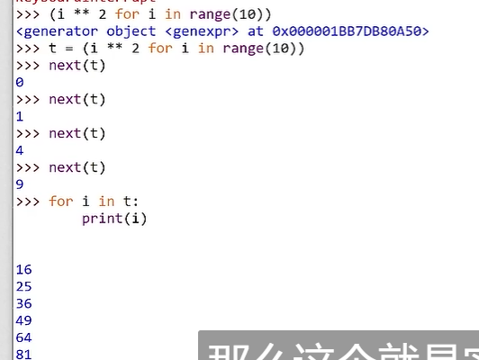

**列表生成式一次返回所有值**  

```python  
def square(n):  
    return [i **2 for i in range(n)]  
  
for i in square(5):  
    print(i, " ", end="")  
```


# 基本数据类型及其操作

## 判断变量类型

```python
import types
if type(text) is types.StringType:
    ....
type(x) == types(1) # 判断是否int 类型
type(x) == type('a') #是否string类型
```


## 数字类型

### 整数类型

#### 注：

python 中不支持 a++ 和 ++a

**与数学中整数的概念一致**

- **可正可负，没有取值范围限制**
- pow(x,y)函数：计算 xy，想算多大算多大
```python
pow(2,100)
1267650600228229401496703205376
pow(2,pow(2,15))
1415461031044954789001553…… 
```

4种进制表示形式
- 十进制： 1010, 99, -217
- 二进制，以0b或0B开头： 0b010, -0B101
- 八进制，以0o或0O开头： 0o123, -0O456
- 十六进制，以0x或0X开头： 0x9a, -0X89 

### 浮点数类型

**与数学中实数的概念一致**

- 带有小数点及小数的数字

- 浮点数取值范围和小数精度都存在限制，但常规计算可忽略

- 取值范围数量级约-10307至10308，精度数量级10-16 

  浮点数间运算存在不确定尾数，不是bug

```python
0.1 + 0.3
0.4
0.1 + 0.2
0.30000000000000004 #不确定尾数 
```

- round(x, d)：对x四舍五入， d是小数截取位数
- 浮点数间运算与比较用round()函数辅助
- 不确定尾数一般发生在10-16左右， round()十分有效 

**浮点数可以采用科学计数法表示**

- 使用字母e或E作为幂的符号，以10为基数，格式如下：
<a>e<b> 表示 a*10b
- 例如： 4.3e-3 值为0.0043 9.6E5 值为960000.0 


### 复数类型
与数学中复数的概念一致
如果x2 = -1，那么x的值是什么？

- 定义 j = -𝟏𝟏 ，以此为基础，构建数学体系
- a+bj 被称为复数，其中， a是实部， b是虚部 

复数实例
z = 1.23e-4+5.6e+89j

- 实部是什么？ z.real 获得实部
- 虚部是什么？ z.imag 获得虚部 

### 数值运算操作符 

**操作符是完成运算的一种符号体系**

| 操作符及使用 | 描述                                                       |
| ------------ | ---------------------------------------------------------- |
| x + y        | 加， x与y之和                                              |
| x – y        | 减， x与y之差                                              |
| x * y        | 乘， x与y之积                                              |
| x / y        | 除， x与y之商 10/3结果是3.3333333333333335                 |
| x // y       | 整数除， x与y之整数商 10//3结果是3                         |
| + x          | x本身                                                      |
| - y          | x的负值                                                    |
| x % y        | 余数，模运算 10%3结果是1                                   |
| x ** y       | 幂运算， x的y次幂， x^y;当y是小数时，开方运算10**0.5结果是 |

| 增强操作符及使用 | 描述                                                         |
| ---------------- | ------------------------------------------------------------ |
| x op= y          | 即 x = x op y，其中， op为二元操作符                         |
| x op= y          | x += y x -= y x *= y x /= y x //= y x %= y x **= y           |
| x op= y          | >>> x = 3.1415 >>> x **= 3  与 x = x **3 等价 31.006276662836743 |

### 数字类型的关系
类型间可进行混合运算，生成结果为"最宽"类型

- 三种类型存在一种逐渐"扩展"或"变宽"的关系：
**整数 -> 浮点数 -> 复数**
- 例如： 123 + 4.0 = 127.0 (整数+浮点数 = 浮点数) 

### 数值运算函数 

一些以函数形式提供的数值运算功能

| 函数及使用        | 描述                                                         |
| ----------------- | ------------------------------------------------------------ |
| abs(x)            | 绝对值， x的绝对值 abs(-10.01) 结果为 10.01                  |
| divmod(x,y)       | 商余， (x//y, x%y)，同时输出商和余数 divmod(10, 3) 结果为 (3, 1) |
| pow(x, y[, z])    | 幂余， (x**y)%z， [..]表示参数z可省略 pow(3, pow(3, 99), 10000) 结果为 4587 |
| round(x[, d])     | 四舍五入， d是保留小数位数，默认值为 round(-10.123, 2) 结果为 -10.12 |
| max(x1,x2, … ,xn) | 最大值，返回x1,x2, … ,xn中的最大值， n不限 max(1, 9, 5, 4, 3) 结果为 9 |
| min(x1,x2, … ,xn) | 最小值，返回x1,x2, … ,xn中的最小值， n不限 min(1, 9, 5, 4, 3) 结果为 1 |
| int(x)            | 将x变成整数，舍弃小数部分 int(123.45) 结果为123； int("123") 结果为123 |
| float(x)          | 将x变成浮点数，增加小数部分 float(12) 结果为12.0； float("1.23") 结果为1.23 |
| complex(x)        | 将x变成复数，增加虚数部分 complex(4) 结果为 4 + 0j           |

# 字符串

**由0个或多个字符组成的有序字符序列**
-字符串是字符的有序序列，可以对其中的字符进行索引

```python
"请"是"请输入带有符号的温度值: "的第0个字符
```

字符串有2类共4种表示方法
-由一对单引号或双引号表示，仅表示单行字符串

```python
"请输入带有符号的温度值: "或者'C'
```

-由一对三单引号或三双引号表示，可表示多行字符串

```python
'''Python
语言'''
```

三引号是多行注释

### 字符串的序号

正向递增序号和反向递减序号

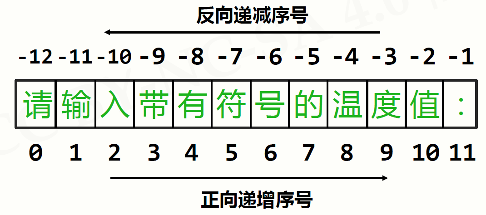

### 字符串的使用

使用[ ]获取字符串中一个或多个字符

#### 索引：

返回字符串中单个字符    <字符串>[M]

```python
"请输入带有符号的温度值: "[0]或者TempStr[-1]
```

#### 切片：

返回字符串中一段字符子串     <字符串>[M: N]

```python
"请输入带有符号的温度值: "[1:3]或者TempStr[0:-1]
```

使用[M:N: K]根据步长(K)对字符串切片

- <字符串>[M: N]，M缺失表示至开头，N缺失表示至结尾

  ```python
  "〇一二三四五六七八九十"[:3]结果是"〇一二"
  ```

- <字符串>[M: N: K]，根据步长K对字符串切片

  ```python
  "〇一二三四五六七八九十"[1:8:2] 结果是"一三五七"
  "〇一二三四五六七八九十"[::-1] 结果是"十九八七六五四三二一〇"
  ```
### 字符串的特殊字符

  转义符\

- 转义符表达特定字符的本意

  ```python
  "这里有个双引号(\")"结果为这里有个双引号(")
  ```

- 转义符形成一些组合，表达一些不可打印的含义

  ```python
  "\b"回退"\n"换行(光标移动到下行首)"\r"回车(光标移动到本行首)
  ```

### 字符串操作符

| 操作符及使用 | 描述                                    |
| ------------ | --------------------------------------- |
| x+ y         | 连接两个字符串x和y                      |
| n *x 或x *n  | 复制n次字符串x                          |
| x in s       | 如果x是s的子串，返回True，否则返回False |

### 字符串的比较操作

​    运算符：`>,>=,<,<=,==,!=`

**比较规则**:首先比较两个字符串中的第- -个字符，如果相等则继续比较下一个字符，依次比较下去，直到两个字符串中的字符不相等时，其比较结果就是两个字符串的比较结果，两个字符串中的所有后续字符将不再被比较

**比较原理**:两字符进行比较时，比较的是其ordinal value(原始值),调用内置函数ord可以得到指定字符的ordinal value（ASCII码）。与内置函数ord对应的是内置函数chr,调用内置函数chr时指定ordinal value可以得到其对应的字符

**== 与 is 的区别**：
		== 比较的是value
		is 比较的是id


```python

print("hello" > "hel")
print("hello" > "interest")
# 第二个，解释：
print(ord("h"), ord("i"))  # 104<145

a=b="123"
c="123"
print(a == b)
print(a is b)
print(a == c)
print(a is c) # 此处显示为true是因为，pycharm做了优化，“123”在驻留池中，a，b，c存储的都是对“123”的引用
```

```
True
False
104 105
True
True
True
True
```


### 字符串处理函数

| 函数及使用     | 描述                                                         |
| -------------- | ------------------------------------------------------------ |
| len(x)         | 长度，返回字符串x的长度<br/>len("一二三456") 结果为6         |
| str(x)         | 任意类型x所对应的字符串形式<br/>str(1.23)结果为"1.23"str([1,2])结果为"[1,2]" |
| hex(x)或oct(x) | 整数x的十六进制或八进制小写形式字符串<br/>hex(425)结果为"0x1a9"oct(425)结果为"0o651" |
| chr(u)         | x为Unicode编码，返回其对应的字符                             |
| ord(x)         | x为字符，返回其对应的Unicode编码                             |

**Unicode编码**

- 统一字符编码，即覆盖几乎所有字符的编码方式
- 从0到1114111(0x10FFFF)空间，每个编码对应一个字符
- **Python字符串中每个字符都是Unicode编码字符**

### 字符串处理方法

| 方法及使用                   | 描述                                                         |
| ---------------------------- | ------------------------------------------------------------ |
| str.lower()或str.upper()     | 返回字符串的副本，全部字符小写/大写<br/>"AbCdEfGh".lower()结果为"abcdefgh" |
| str.split(sep=None)          | 返回一个列表，由str根据sep被分隔的部分组成<br/>"A,B,C".split(",")结果为['A','B','C'] |
| str.count(sub)               | 返回子串sub在str中出现的次数<br/>"an apple a day".count("a")结果为4 |
| str.replace(old, new)        | 返回字符串str副本，所有old子串被替换为new<br/>"python".replace("n","n123.io")结果为<br/>"python123.io" |
| str.center(width[,fillchar]) | 字符串str根据宽度width居中，fillchar可选<br/>` "python".center(20,"=")结果为<br/>'=======python======='` |
| str.strip(chars)             | 从str中去掉在其左侧和右侧chars中列出的字符                   |
| str.join(iter)               | 在iter变量除最后元素外每个元素后增加一个str<br/>",".join("12345")结果为<br/>"1,2,3,4,5"#主要用于字符串分隔等 |

#### 字符串搜索相关

```
str.find('t')            //搜索指定字符串，没有返回-1

str.find('t',start)      //指定起始位置搜索

str.find('t',start,end)  //指定起始及结束位置搜索：

str.rfind('t')           //从右边开始查找

str.count('t')           //搜索到多少个指定字符串：

eg:

>>> 'skate'.find('t')

3

>>> 'skate'.find('t',2)

3

>>> 'skate'.find('t',2,4)


>>> 'skate'.rfind('t')

3

>>> 'skate'.count('t')

1
```

原文链接：https://blog.csdn.net/weixin_39763953/article/details/111850409

### 字符串类型的格式化

格式化是对字符串进行格式表达的方式

- 字符串格式化使用.format()方法，用法如下：

  ```python
  <模板字符串>.format(<逗号分隔的参数>)
  ```

  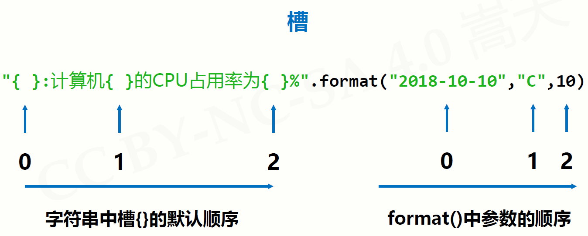

#### format()方法的格式控制

槽内部对格式化的配置方式

```python
{ <参数序号> ：<格式控制标记>}
```

| ：       | <填充>             | <对齐>                               | <宽度>           | <,>              | <.精度>                                 | <类型>                                                      |
| -------- | ------------------ | ------------------------------------ | ---------------- | ---------------- | --------------------------------------- | ----------------------------------------------------------- |
| 引导符号 | 用于填充的单个字符 | < 左对齐<br/>> 右对齐<br/>^ 居中对齐 | 槽设定的输出宽度 | 数字的千位分隔符 | 浮点数小数精度或字符串最大输出长度<br/> | 整数类型<br/>b, c, d, o, x, X<br/>浮点数类型<br/>e, E, f, % |

```python
>>>"{0:=^20}".format("PYTHON")
'=======PYTHON======='
>>>"{0:*>20}".format("BIT")
'*****************BIT'
>>>"{:10}".format("BIT")
'BIT '
>>>"{0:,.2f}".format(12345.6789)
'12,345.68'
>>>"{0:b},{0:c},{0:d},{0:o},{0:x},{0:X}".format(425)
'110101001,Ʃ,425,651,1a9,1A9'
>>>"{0:e},{0:E},{0:f},{0:%}".format(3.14)
'3.140000e+00,3.140000E+00,3.140000,314.000000%'
```

# 序列类型iterator

Iterator Types

**序列是一个基类类型**

序列类型定义
序列是具有先后关系的一组元素

- 序列是一维元素向量，元素类型可以不同
- 类似数学元素序列：`s0, s1, … , sn-1`
- 元素间由序号引导，通过下标访问序列的特定元素

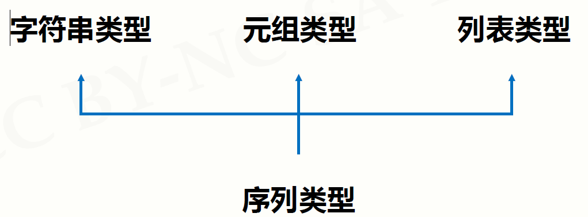


### 序列处理函数及方法

6个操作符

| 操作符及应用        | 描述                                         |
| ------------------- | -------------------------------------------- |
| x in s              | 如果x是序列s的元素，返回True，否则返回False  |
| x not in s          | 如果x是序列s的元素，返回False，否则返回True  |
| s + t               | 连接两个序列s和t                             |
| `s*n 或n*s`         | 将序列s复制n次                               |
| s[i]                | 索引，返回s中的第i个元素，i是序列的序号      |
| s[i: j]或s[i: j: k] | 切片，返回序列s中第i到j以k为步长的元素子序列 |

5个函数和方法

| 函数和方法                        | 描述                                           |
| --------------------------------- | ---------------------------------------------- |
| len(s)                            | 返回序列s的长度，即元素个数                    |
| min(s)                            | 返回序列s的最小元素，s中元素需要可比较         |
| max(s)                            | 返回序列s的最大元素，s中元素需要可比较         |
| s.index(x) 或<br/>s.index(x, i,j) | 返回序列s从i开始到j位置中第一次出现元素x的位置 |
| s.count(x)                        | 返回序列s中出现x的总次数                       |

### 元组类型定义
元组是序列类型的一种扩展

- 元组是一种序列类型，**一旦创建就不能被修改**
- 使用小括号() 或tuple() 创建，元素间用逗号, 分隔
- 可以使用或不使用小括号

```python
def func():
	return1,2
```

```python
>>>creature = "cat", "dog","tiger","human"
>>>creature
('cat', 'dog', 'tiger', 'human')
>>>color = (0x001100, "blue", creature)
>>>color
(4352, 'blue', ('cat', 'dog', 'tiger', 'human'))
```

#### 元组类型操作
- 元组继承了序列类型的全部通用操作
- -元组因为创建后不能修改，因此没有特殊操作

### 列表类型

列表是序列类型的一种扩展，十分常用

- 列表是一种序列类型，创建后可以随意被修改
- 使用方括号[] 或list() 创建，元素间用逗号, 分隔
- 列表中各元素类型可以不同，无长度限制

#### 列表类型操作函数和方法

| 函数或方法      | 描述                                   |
| --------------- | -------------------------------------- |
| ls[i] = x       | 替换列表ls第i元素为x                   |
| ls[i: j: k]= lt | 用列表lt替换ls切片后所对应元素子列表   |
| del ls[i]       | 删除列表ls中第i元素                    |
| del ls[i: j: k] | 删除列表ls中第i到第j以k为步长的元素    |
| ls += lt        | 更新列表ls，将列表lt元素增加到列表ls中 |
| ls *= n         | 更新列表ls，其元素重复n次              |
| ls.append(x)    | 在列表ls最后增加一个元素x              |
| ls.clear()      | 删除列表ls中所有元素                   |
| ls.copy()       | 生成一个新列表，赋值ls中所有元素       |
| ls.insert(i,x)  | 在列表ls的第i位置增加元素x             |
| ls.pop(i)       | 将列表ls中第i位置元素取出并删除该元素  |
| ls.remove(x)    | 将列表ls中出现的第一个元素x删除        |
| ls.reverse()    | 将列表ls中的元素反转                   |
|                 |                                        |

# 集合类型

集合是多个元素的无序组合
- **集合类型与数学中的集合概念一致**
- 集合元素之间无序，每个元素唯一，不存在相同元素
- 集合元素不可更改，不能是可变数据类型 为什么？ 
- **集合用大括号 {} 表示，元素间用逗号分隔**
- **建立集合类型用 {} 或 set()**
- **建立空集合类型，必须使用set()** 

```python
>>> A = {"python", 123, ("python",123)} #使用{}建立集合
{123, 'python', ('python', 123)}
>>> B = set("pypy123") #使用set()建立集合
{'1', 'p', '2', '3', 'y'}
>>> C = {"python", 123, "python",123}
{'python', 123}
```

### 集合操作符 

| 操作符及应用    | 描述                                           |
| --------------- | ---------------------------------------------- |
| S \| T          | 并，返回一个新集合，包括在集合S和T中的所有元素 |
| S - T           | 差，返回一个新集合，包括在集合S但不在T中的元素 |
| S & T           | 交，返回一个新集合，包括同时在集合S和T中的元素 |
| S ^ T           | 补，返回一个新集合，包括集合S和T中的非相同元素 |
| S <= T 或 S < T | 返回True/False，判断S和T的子集关系             |
| S >= T 或 S > T | 返回True/False，判断S和T的包含关系             |
| S \|= T         | 并，更新集合S，包括在集合S和T中的所有元素      |
| S -= T          | 差，更新集合S，包括在集合S但不在T中的元素      |
| S &= T          | 交，更新集合S，包括同时在集合S和T中的元素      |
| S ^= T          | 补，更新集合S，包括集合S和T中的非相同元素      |

```python
>>> A = {"p", "y" , 123}
>>> B = set("pypy123")
>>> A-B
{123}
>>> B-A
{'3', '1', '2'}
>>> A&B
{'p', 'y'}
>>> A|B
{'1', 'p', '2', 'y', '3', 123}
>>> A^B
{'2', 123, '3', '1'}
```

### 集合处理方法 

| S.add(x)     | 如果x不在集合S中，将x增加到S                         |
| ------------ | ---------------------------------------------------- |
| S.discard(x) | 移除S中元素x，如果x不在集合S中，不报错               |
| S.remove(x)  | 移除S中元素x，如果x不在集合S中，产生KeyError异常     |
| S.clear()    | 移除S中所有元素                                      |
| S.pop()      | 随机返回S的一个元素，更新S，若S为空产生KeyError异常  |
| S.copy()     | 返回集合S的一个副本                                  |
| len(S)       | 返回集合S的元素个数                                  |
| x in S       | 判断S中元素x， x在集合S中，返回True，否则返回False   |
| x not in S   | 判断S中元素x， x不在集合S中，返回True，否则返回False |
| set(x)       | 将其他类型变量x转变为集合类型                        |

```python
>>> A = {"p", "y" , 123}
>>> for item in A:
print(item, end="")
p123y
>>> A
{'p', 123, 'y'}
>>> try:
while True:
print(A.pop(), end=""))
except:
pass
p123y
>>> A
set()
```

### 集合类型应用场景 

包含关系比较

```python
"p" in {"p", "y" , 123}
True
{"p", "y"} >= {"p", "y" , 123}
False 
```

数据去重：集合类型所有元素无重复 

```python
>>> ls = ["p", "p", "y", "y", 123]
>>> s = set(ls) # 利用了集合无重复元素的特点
{'p', 'y', 123}
>>> lt = list(s) # 还可以将集合转换为列表
['p', 'y', 123]
```

# 字典类型及操作 

### 字典类型定义 

字典类型是“映射”的体现 

映射是一种键(索引)和值(数据)的对应
- 键值对：键是数据索引的扩展
- 字典是键值对的集合，键值对之间无序
- 采用大括号`{}`和dict()创建，键值对用冒号: 表示
{<键1>:<值1>, <键2>:<值2>, … , <键n>:<值n>} 

在字典变量中，通过键获得值
<字典变量> = {<键1>:<值1>, … , <键n>:<值n>}
<值> = <字典变量>[<键>]
**[ ] 用来向字典变量中索引或增加元素**

```python
<字典变量>[<键>] = <值> 
```


```python
>>> d = {"中国":"北京", "美国":"华盛顿", "法国":"巴黎"}
>>> d
{'中国': '北京', '美国': '华盛顿', '法国': '巴黎'}
>>> d["中国"]
'北京'
>>> de = {} ; type(de)
<class 'dict'>
type(x)
返回变量x的类型
```

### 字典类型操作函数和方法 

| 函数或方法          | 描述                                            |
| ------------------- | ----------------------------------------------- |
| del d[k]            | 删除字典d中键k对应的数据值                      |
| k in d              | 判断键k是否在字典d中，如果在返回True，否则False |
| d.keys()            | 返回字典d中所有的键信息                         |
| d.values()          | 返回字典d中所有的值信息                         |
| d.items()           | 返回字典d中所有的键值对信息                     |
| d.get(k, <default>) | 键k存在，则返回相应值，不在则返回<default>值    |
| d.pop(k, <default>) | 键k存在，则取出相应值，不在则返回<default>值    |
| d.popitem()         | 随机从字典d中取出一个键值对，以元组形式返回     |
| d.clear()           | 删除所有的键值对                                |
| len(d)              | 返回字典d中元素的个数                           |

```python
>>> d = {"中国":"北京", "美国":"华盛顿", "法国":"巴黎"}
>>> "中国" in d
True
>>> d.keys()
dict_keys(['中国', '美国', '法国'])
>>> d.values()
dict_values(['北京', '华盛顿', '巴黎'])

>>> d = {"中国":"北京", "美国":"华盛顿", "法国":"巴黎"}
>>> d.get("中国","伊斯兰堡")
'北京'
>>> d.get("巴基斯坦","伊斯兰堡")
'伊斯兰堡'
>>> d.popitem()
('美国', '华盛顿')
```

元素遍历

```python
for k in d :
<语句块>
```


# 文件处理

## 文件的理解

**文件是数据的抽象和集合**

- 文件是存储在辅助存储器上的数据序列
- 文件是数据存储的一种形式
- 文件展现形态：文本文件和二进制文件 

**文本文件 vs. 二进制文件**

- 文件文件和二进制文件只是文件的展示方式
- 本质上，所有文件都是二进制形式存储
- 形式上， 所有文件采用两种方式展示 

### 文本文件 

- 由单一特定编码组成的文件，如UTF-8编码
- 由于存在编码，也被看成是存储着的长字符串
- 适用于例如： .txt文件、 .py文件等 

### 二进制文件 

- 直接由比特0和1组成， 没有统一字符编码
- 一般存在二进制0和1的组织结构，即文件格式
- 适用于例如： .png文件、 .avi文件等 

### 文本文件vs二进制文件

**f.txt文件保存：“中国是一个伟大的国家！”；**

#### 文本形式打开文件

```python
#tf = open("f.txt", mode="rt",encoding='UTF-8') 能指定编码
tf = open("f.txt", "rt",encoding='UTF-8')
print(tf.readline())
tf.close()

============= RESTART: E:/Codes/Python/new/file.py ====================
中国是一个伟大的国家！
>>> 
```

#### 二进制形式打开文件

```python
tf = open("f.txt", mode="rb")
#tf = open("f.txt", "rb")
print(tf.readline())
tf.close()

====== RESTART: E:/Codes/Python/new/file.py ====================
b'\xe4\xb8\xad\xe5\x9b\xbd\xe6\x98\xaf\xe4\xb8\x80\xe4\xb8\xaa\xe4\xbc\x9f\xe5\xa4\xa7\xe7\x9a\x84\xe5\x9b\xbd\xe5\xae\xb6\xef\xbc\x81'
>>> 
```

## 文件的使用

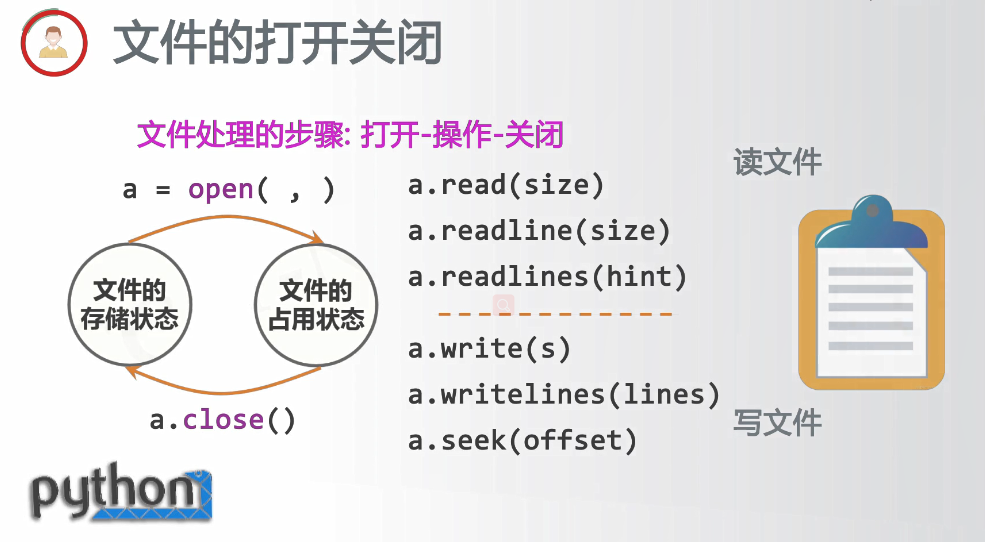

文件的打开

```python
<变量名(文件句柄)> = open(<文件名|文件路径和名称>, <打开模式 |文本 or 二进制|读 or 写 >)
```

文件路径和名称
源文件同目录可省路径

```
"D:/PYE/f.txt"
"D:\\PYE\\f.txt" "f.txt"
"./PYE/f.txt" 
```

## 打开模式 

**文本形式、只读模式、默认值**

| 文件的打开模式 | 描述                                                    |
| -------------- | ------------------------------------------------------- |
| 'r'            | 只读模式，默认值，如果文件不存在，返回FileNotFoundError |
| 'w'            | 覆盖写模式，文件不存在则创建，存在则完全覆盖            |
| 'x'            | 创建写模式，文件不存在则创建，存在则返回FileExistsError |
| 'a'            | 追加写模式，文件不存在则创建，存在则在文件最后追加内容  |
| 'b'            | 二进制文件模式                                          |
| 't'            | 文本文件模式，默认值                                    |
| '+'            | 与r/w/x/a一同使用，在原功能基础上增加同时读写功能       |

```python
f = open("f.txt")
f = open("f.txt", "rt")
f = open("f.txt", "w")
f = open("f.txt", "a+")
f = open("f.txt", "x")
f = open("f.txt", "b")
f = open("f.txt", "wb")
- 文本形式、只读模式、默认值
- 文本形式、只读模式、同默认值
- 文本形式、覆盖写模式
- 文本形式、追加写模式+ 读文件
- 文本形式、创建写模式
- 二进制形式、只读模式
- 二进制形式、覆盖写模式
```

```python
#文本形式打开文件
tf = open("f.txt", "rt")
print(tf.readline())
tf.close()
#二进制形式打开文件
bf = open("f.txt", "rb")
print(bf.readline())
bf.close()
```

## 文件内容的读取 

| 操作方法               | 描述                                                         |
| ---------------------- | ------------------------------------------------------------ |
| <f>.read(size=-1)      | 读入全部内容，如果给出参数，读入前size长度 >>>s = f.read(2) 中国 |
| <f>.readline(size=-1)  | 读入一行内容，如果给出参数，读入该行前size长度 >>>s = f.readline() 中国是一个伟大的国家！ |
| <f>.readlines(hint=-1) | 读入文件所有行，以每行为元素形成列表 如果给出参数，读入前hint行 >>>s = f.readlines() ['中国是一个伟大的国家！ '] |

**文件的逐行操作** 

逐行遍历文件：方法一

- **一次读入，分行处理**

```python
fname = input("请输入要打开的文件名称:")
fo = open(fname,"r")
for line in fo.readlines():
	print(line)
fo.close()
```

逐行遍历文件：方法二

- **分行读入，逐行处理**

```python
fname = input("请输入要打开的文件名称:")
fo = open(fname,"r")
for line in fo:
print(line)
fo.close()
```

## 数据的文件写入 

| 操作方法              | 描述                                                         |
| --------------------- | ------------------------------------------------------------ |
| <f>.write(s)          | 向文件写入一个字符串或字节流 >>>f.write("中国是一个伟大的国家!") |
| <f>.writelines(lines) | 将一个元素全为字符串的列表写入文件 >>>ls = ["中国", "法国", "美国"] >>>f.writelines(ls) 中国法国美国 |
| <f>.seek(offset)      | 改变当前文件操作指针的位置， offset含义如下： 0 – 文件开头； 1 – 当前位置； 2 – 文件结尾 >>>f.seek(0) #回到文件开头 |

**数据的文件写入** 

- 写入一个字符串列表(没有任何输出)

```python
fo = open("output.txt","w+")
ls = ["中国", "法国", "美国"]
fo.writelines(ls)
for line in fo:
 print(line)
fo.close()
```

- 写入一个字符串列表

```python
fo = open("output.txt","w+")
ls = ["中国", "法国", "美国"]
fo.writelines(ls)
fo.seek(0)
for line in fo:
 print(line)
fo.close()
```

## with open


**文件使用完毕后必须关闭，因为文件对象会占用操作系统的资源，并且操作系统同一时间能打开的文件数量也是有限的**：

```
f.close()
```

由于文件读写时都有可能产生`IOError`，一旦出错，后面的`f.close()`就不会调用。所以，为了保证无论是否出错都能正确地关闭文件，我们可以使用`try ... finally`来实现：

```python
try:
    f = open('/path/to/file', 'r')
    print(f.read())
finally:
    if f:
        f.close()
```

但是每次都这么写实在太繁琐，所以，Python引入了`with`语句来自动帮我们调用`close()`方法：

```python
with open('/path/to/file', 'r') as f:
    print(f.read())
```

这和前面的`try ... finally`是一样的，但是代码更佳简洁，并且不必调用`f.close()`方法。

## 遍历文件夹下的所有文件

```python
for root, dirs, files in os.walk(file):

        # root 表示当前正在访问的文件夹路径
        # dirs 表示该文件夹下的子目录名list
        # files 表示该文件夹下的文件list

        # 遍历文件
        for f in files:
            print(os.path.join(root, f))

        # 遍历所有的文件夹
        for d in dirs:
            print(os.path.join(root, d))
```

## 删除文件

os.remove() 方法用于删除指定路径的文件。**如果指定的路径是一个目录，将抛出OSError**。

在Unix, Windows中有效

### 语法

**remove()**方法语法格式如下：

```
`os.remove(path)`
```

### 参数

- **path** -- 要移除的文件路径

### 返回值

该方法没有返回值

## 复制目录及文件

```python
shutil.copytree(source_dir, target_dir)
```

# python常用标准库

标准库
Python
计算生态 = 标准库 + 第三方库

- 标准库：随解释器直接安装到操作系统中的功能模块
- 第三方库：需要经过安装才能使用的功能模块
-  库 Library 、包 Package 、模块 Module ，统称 模块

## turtle库
### 基本介绍

turtle(海龟) 库是 turtle 绘图体系的 Python 实现

- turtle 绘图体系： 1969 年诞生，主要用于程序设计入门
- Python 语言的 标准库 之一
- 入门级的图形绘制函数库

### turtle绘图窗体布局


```python
turtle.setup( width , height, startx , starty)
```

setup() 设置窗体大小及位置

- 4 个参数中后两个可选
- setup() 不是必须的

### turtle空间坐标体系


```python
turtle.goto( x, y)
```

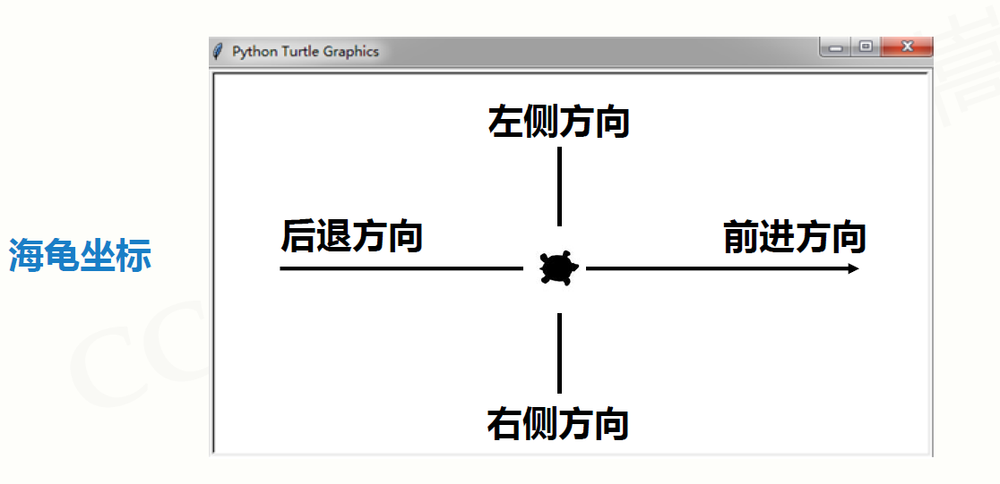


### turtle角度坐标体系


```python
turtle.seth(angle)
```

- seth()改变海龟行进方向
- angle为绝对度数
- seth()只改变方向但不行进


### RGB色彩体系

#### RGB色彩模式由
由三种颜色构成的万物色

-	RGB指红蓝绿三个通道的颜色组合
-	覆盖视力所能感知的所有颜色
-	RGB每色取值范围0-255整数或0-1小数

#### turtle的RGB色彩模式
默认采用小数值 可切换为整数值

```python
turtle.colormode(mode)
```

-	1.0：RGB小数值模式
-	255：RGB整数值模式

## time库

time库是Python中处理时间的标准库

- 计算机时间的表达
- 提供获取系统时间并格式化输出功能
- 提供系统级精确计时功能，用于程序性能分析

```python
import time
time.<b>()
```

### time库包括三类函数

- 时间获取：time() ctime() gmtime()
- 时间格式化：strftime() strptime()
- 程序计时：sleep(), perf_counter()

### 时间获取

| 函数     | 描述                                                         |
| -------- | ------------------------------------------------------------ |
| time()   | 获取当前时间戳，即计算机内部时间值，浮点数>>>time.time()<br/>1516939876.6022282 |
| ctime()  | 获取当前时间并以易读方式表示，返回字符串<br/>>>time.ctime()'Fri Jan 26 12:11:16 2018' |
| gmtime() | 获取当前时间，表示为计算机可处理的时间格式>>>time.gmtime()<br/>time.struct_time(tm_year=2018, tm_mon=1,   tm_mday=26, tm_hour=4, tm_min=11, tm_sec=16,  tm_wday=4, tm_yday=26, tm_isdst=0) |

### 时间格式化

- 格式化：类似字符串格式化，需要有展示模板
- 展示模板由特定的格式化控制符组成
- strftime()方法

```python
strftime(tpl, ts)
```

tpl是格式化模板字符串，用来定义输出效果
ts是计算机内部时间类型变量

```python
>>>t = time.gmtime()
>>>time.strftime("%Y-%m-%d %H:%M:%S",t) '2018-01-26 12:55:20'
```

#### 格式化控制符

| 格式化字符串 | 日期/时间说明 | 值范围和实例                   |
| ------------ | ------------- | ------------------------------ |
| %Y           | 年份          | 0000~9999，例如：1900          |
| %m           | 月份          | 01~12，例如：10                |
| %B           | 月份名称      | January~December，例如：April  |
| %b           | 月份名称缩写  | Jan~Dec，例如：Apr             |
| %d           | 日期          | 01~31，例如：25                |
| %A           | 星期          | Monday~Sunday，例如：Wednesday |
| %a           | 星期缩写      | Mon~Sun，例如：Wed             |
| %H           | 小时（24h制） | 00~23，例如：12                |
| %I           | 小时（12h制） | 01~12，例如：7                 |
| %p           | 上/下午       | AM, PM，例如：PM               |
| %M           | 分钟          | 00~59，例如：26                |
| %S           | 秒            | 00~59，例如：26                |

```python
>>>t = time.gmtime()
>>>time.strftime("%Y-%m-%d %H:%M:%S",t)
```

```python
>>>timeStr = '2018-01-26 12:55:20'
>>>time.strptime(timeStr, “%Y-%m-%d %H:%M:%S”)
```

### 程序计时

程序计时应用广泛

- 程序计时指测量起止动作所经历时间的过程
- 测量时间：perf_counter()
- 产生时间：sleep()

```python
perf_counter()
```

返回一个CPU级别的精确时间计数值，单位为秒由于这个计数值起点不确定，连续调用差值才有意义

```python
>>>start = time.perf_counter() 318.66599499718114
>>>end = time.perf_counter() 341.3905185375658
>>>end - start
>>>22.724523540384666
```

sleep(s)

s拟休眠的时间，单位是秒，可以是浮点数

```python
>>>def wait():
time.sleep(3.3)
>>>wait() #程序将等待3.3秒后再退出
```

## random库

random库是使用随机数的Python标准库

- 伪随机数: 采用梅森旋转算法生成的(伪)随机序列中元素
- random库主要用于生成随机数
- 使用random库: `import random`

### 常用函数

random库包括两类函数，常用共8个

- 基本随机数函数：seed(),random()
- 扩展随机数函数：`randint(), getrandbits(), uniform(),
  randrange(), choice(), shuffle()`

### 基本随机数函数

| 函数         | 描述                                                         |
| ------------ | ------------------------------------------------------------ |
| seed(a=None) | 初始化给定的随机数种子，默认为当前系统时间<br>>>>random.seed(10) #产生种子10对应的序列 |
| random()     | 生成一个[0.0, 1.0)之间的随机小数<br/>`>>>random.random()`<br/>0.5714025946899135 |

| 函数                 | 描述                                                         |
| -------------------- | ------------------------------------------------------------ |
| randint(a, b)        | 生成一个[a, b]之间的整数<br/>>>>random.randint(10, 100)<br/>64 |
| randrange(m, n[, k]) | 生成一个[m, n)之间以k为步长的随机整数<br/>>>>random.randrange(10, 100, 10)<br/>80 |
| getrandbits(k)       | 生成一个k比特长的随机整数<br/>>>>random.getrandbits(16)<br/>37885 |
| uniform(a,b)         | 生成一个[a, b]之间的随机小数<br/>>>>random.uniform(10, 100)<br/>13.096321648808136 |
| choice(seq)          | 从序列seq中随机选择一个元素<br/>>>>random.choice([1,2,3,4,5,6,7,8,9])<br/>8 |
| shuffle(seq)         | 将序列seq中元素随机排列，返回打乱后的序列<br/>>>>s=[1,2,3,4,5,6,7,8,9];random.shuffle(s);print(s)<br/>[3, 5, 8, 9, 6, 1, 2, 7, 4] |


## os库

### os库基本介绍

os库提供通用的、基本的操作系统交互功能

-	os库是Python标准库，包含几百个函数
-	常用路径操作、进程管理、环境参数等几类
-	路径操作：os.path子库，处理文件路径及信息
-	进程管理：启动系统中其他程序
-	环境参数：获得系统软硬件信息等环境

### os库之路径操作

路径操作
`os.path`子库以path为入口，用于操作和处理文件路径

```python
import os.path
或
import os.path as op
```

| 函数                       | 描述                                                         |
| -------------------------- | ------------------------------------------------------------ |
| os.path.abspath(path)      | 返回path在当前系统中的绝对路径<br/>>>>os.path.abspath("file.txt")<br/>'C:\\Users\\Tian Song\\Python36-32\\file.txt' |
| os.path.normpath(path)     | 归一化path的表示形式，统一用\\分隔路径<br/>>>>os.path.normpath("D://PYE//file.txt")<br/>'D:\\PYE\\file.txt' |
| os.path.relpath(path)      | 返回当前程序与文件之间的相对路径 (relative path)<br/>>>>os.path.relpath("C://PYE//file.txt")<br/>'..\\..\\..\\..\\..\\..\\..\\PYE\\file.txt' |
| os.path.dirname(path)      | 返回path中的目录名称<br/>>>>os.path.dirname("D://PYE//file.txt")<br/>'D://PYE' |
| os.path.basename(path)     | 返回path中最后的文件名称<br/>>>>os.path.basename("D://PYE//file.txt")<br/>'file.txt' |
| os.path.join(path, *paths) | 组合path与paths，返回一个路径字符串<br/>>>>os.path.join("D:/", "PYE/file.txt")<br/>'D:/PYE/file.txt' |
| os.path.exists(path)       | 判断path对应文件或目录是否存在，返回True或False<br/>>>>os.path.exists("D://PYE//file.txt")<br/>False |
| os.path.isfile(path)       | 判断path所对应是否为已存在的文件，返回True或False<br/>>>>os.path.isfile("D://PYE//file.txt")<br/>True |
| os.path.isdir(path)        | 判断path所对应是否为已存在的目录，返回True或False<br/>>>>os.path.isdir("D://PYE//file.txt")<br/>False |
| os.path.getatime(path)     | 返回path对应文件或目录上一次的访问时间<br/>>>>os.path.getatime("D:/PYE/file.txt")<br/>1518356633.7551725 |
| os.path.getmtime(path)     | 返回path对应文件或目录上一次的访问时间<br/>>>>os.path.getatime("D:/PYE/file.txt")<br/>1518356633.7551725 |
| os.path.getmtime(path)     | 返回path对应文件或目录最近一次的修改时间<br/>>>>os.path.getmtime("D:/PYE/file.txt")<br/>1518356633.7551725 |
| os.path.getctime(path)     | 返回path对应文件或目录的创建时间<br/>time.ctime(os.path.getctime("D:/PYE/file.txt"))<br/>'Sun Feb 11 21:43:53 2018' |
| os.path.getsize(path)      | 返回path对应文件的大小，以字节为单位<br/>>>>os.path.getsize("D:/PYE/file.txt")<br/>180768 |

### 获取当前文件路径

```python
print(os.getcwd())
print(os.path.abspath('.'))
print(os.path.abspath(os.curdir))
```


### os库之进程管理

```python
os.system(command)
```

-	执行程序或命令command
-	在Windows系统中，返回值为cmd的调用返回信息

```python
import os
os.system("C:\\Windows\\System32\\calc.exe")
>>>
0
```

### os库之环境信息

获取或改变系统环境信息

| 函数           | 描述                                                         |
| -------------- | ------------------------------------------------------------ |
| os.chdir(path) | 修改当前程序操作的路径>>>os.chdir("D:")                      |
| os.getcwd()    | 返回程序的当前路径<br/>>>>os.getcwd()<br/>'D:\\'             |
| os.getlogin()  | 获得当前系统登录用户名称>>>os.getlogin() 'Tian Song'         |
| os.cpu_count() | 获得当前系统的CPU数量>>>os.cpu_count() 8                     |
| os.urandom(n)  | 获得n个字节长度的随机字符串，通常用于加解密运算<br/>>>>os.urandom(10)<br/>b'7\xbe\xf2!\xc1=\x01gL\xb3' |

# 正则表达式

**regular expression, regex, RE**   

## 什么是正则表达式  

正则表达式是对字符串串操作的一种逻辑公式，就是用事先定义好的一些特定  字符、及这些特定字符的组合，组成一个“规则字符串串”，这个“规则字符串”用  来表达对字符串的一种过滤逻辑。  
非Python独有，re模块实现

## 常见匹配模式

| 模式     | 描述                                                         |
| -------- | ------------------------------------------------------------ |
| \w       | 匹配字母数字及下划线                                         |
| \W       | 匹配非字母数字下划线                                         |
| \s       | 匹配任意空白字符，等价于 [\t\n\r\f].                         |
| \S       | 匹配任意非空字符                                             |
| \d       | 匹配任意数字，等价于 [0-9]                                   |
| \D       | 匹配任意非数字                                               |
| \A       | 匹配字符串开始                                               |
| \Z       | 匹配字符串结束，如果是存在换行，只匹配到换行前的结束字符串   |
| \z       | 匹配字符串结束                                               |
| \G       | 匹配最后匹配完成的位置                                       |
| \n       | 匹配一个换行符                                               |
| \t       | 匹配一个制表符                                               |
| ^        | 匹配字符串的开头                                             |
| $        | 匹配字符串的末尾。                                           |
| .        | 匹配任意字符，除了换行符，当re.DOTALL标记被指定时，则可以匹配包括换行符的任意字符。 |
| [...]    | 用来表示一组字符,单独列出：[amk] 匹配 'a'，'m'或'k'          |
| [^...]   | 不在[]中的字符：[^abc] 匹配除了a,b,c之外的字符。             |
| *        | 匹配0个或多个的表达式。                                      |
| +        | 匹配1个或多个的表达式。                                      |
| ?        | 匹配0个或1个由前面的正则表达式定义的片段，非贪婪方式         |
| {n}      | 精确匹配n个前面表达式。                                      |
| {n, m}   | 匹配 n 到 m 次由前面的正则表达式定义的片段，贪婪方式         |
| a&#124;b | 匹配a或b                                                     |
| ( )      | 匹配括号内的表达式，也表示一个组                             |

## re.match

re.match 尝试从字符串的起始位置匹配一个模式，如果不是起始位置匹配成功的话，match()就返回none。

```python
re.match(pattern, string, flags=0)
```

### 最常规的匹配

```python
import re

content = 'Hello 123 4567 World_This is a Regex Demo'
print(len(content))
result = re.match('^Hello\s\d\d\d\s\d{4}\s\w{10}.*Demo$', content)
print(result)
print(result.group())
print(result.span())
```

out:

```
41
<re.Match object; span=(0, 41), match='Hello 123 4567 World_This is a Regex Demo'>
Hello 123 4567 World_This is a Regex Demo
(0, 41)
```

### 泛匹配

.*来匹配任意字段

```python
import re

content = 'Hello 123 4567 World_This is a Regex Demo'
result = re.match('^Hello.*Demo$', content)
print(result)
print(result.group())
print(result.span())
```

out:

```
<re.Match object; span=(0, 41), match='Hello 123 4567 World_This is a Regex Demo'>
Hello 123 4567 World_This is a Regex Demo
(0, 41)
```

### 匹配目标

通过添加`()`进行分组，提取，指定数据

```python
import re

content = 'Hello 1234567 World_This is a Regex Demo'
result = re.match('^Hello\s(\d+)\sWorld.*Demo$', content)
print(result)
print(result.group(1))
print(result.span())
```

out:

```
<re.Match object; span=(0, 40), match='Hello 1234567 World_This is a Regex Demo'>
1234567
(0, 40)
```


### 贪婪匹配

Re库默认采用**贪婪匹配**

```python
import re

content = 'Hello 1234567 World_This is a Regex Demo'
result = re.match('^He.*(\d+).*Demo$', content)
print(result)
print(result.group(1))

```

out: `.*`匹配掉了尽可能多的字符

```
<re.Match object; span=(0, 40), match='Hello 1234567 World_This is a Regex Demo'>
7
```

### 非贪婪匹配

只要长度输出可能不同的，都可以通过在操作符后**增加?变成最小匹配**

```python
import re

content = 'Hello 1234567 World_This is a Regex Demo'
result = re.match('^He.*?(\d+).*Demo$', content)
print(result)
print(result.group(1))
```

out:

```
<re.Match object; span=(0, 40), match='Hello 1234567 World_This is a Regex Demo'>
1234567
```


### 匹配模式

通过设置匹配模式，将`.`能匹配换行符

```python
import re

content = '''Hello 1234567 World_This
is a Regex Demo
'''
result = re.match('^He.*?(\d+).*?Demo$', content, re.S)
print(result.group(1))

```

out:

```
1234567

```

### 转义

```python
import re

content = 'price is $5.00'
result = re.match('price is $5.00', content)
print(result)
```

```
None
```

```python
import re

content = 'price is $5.00'
result = re.match('price is \$5\.00', content)
print(result)
```

out:

```
<re.Match object; span=(0, 14), match='price is $5.00'>
```

总结：尽量使用**泛匹配、使用括号得到匹配目标、尽量使用非贪婪模式、有换行符就用re.S**

## re.search

**re.search 扫描整个字符串并返回第一个成功的匹配。**

```python
import re

content = 'Extra stings Hello 1234567 World_This is a Regex Demo Extra stings'
result = re.match('Hello.*?(\d+).*?Demo', content)
print(result)
```

```
None
```


```python
import re

content = 'Extra stings Hello 1234567 World_This is a Regex Demo Extra stings'
result = re.search('Hello.*?(\d+).*?Demo', content)
print(result)
print(result.group(1))
```

```
<re.Match object; span=(13, 53), match='Hello 1234567 World_This is a Regex Demo'>
1234567
```

总结：**为匹配方便，能用search就不用match**


### 匹配演练

```python
import re

html = '''<div id="songs-list">
    <h2 class="title">经典老歌</h2>
    <p class="introduction">
        经典老歌列表
    </p>
    <ul id="list" class="list-group">
        <li data-view="2">一路上有你</li>
        <li data-view="7">
            <a href="/2.mp3" singer="任贤齐">沧海一声笑</a>
        </li>
        <li data-view="4" class="active">
            <a href="/3.mp3" singer="齐秦">往事随风</a>
        </li>
        <li data-view="6"><a href="/4.mp3" singer="beyond">光辉岁月</a></li>
        <li data-view="5"><a href="/5.mp3" singer="陈慧琳">记事本</a></li>
        <li data-view="5">
            <a href="/6.mp3" singer="邓丽君"><i class="fa fa-user"></i>但愿人长久</a>
        </li>
    </ul>
</div>'''
result = re.search('<li.*?active.*?singer="(.*?)">(.*?)</a>', html, re.S)
if result:
    print(result.group(1), result.group(2))

```


import re

html = '''<div id="songs-list">
    <h2 class="title">经典老歌</h2>
    <p class="introduction">
        经典老歌列表
    </p>
    <ul id="list" class="list-group">
        <li data-view="2">一路上有你</li>
        <li data-view="7">
            <a href="/2.mp3" singer="任贤齐">沧海一声笑</a>
        </li>
        <li data-view="4" class="active">
            <a href="/3.mp3" singer="齐秦">往事随风</a>
        </li>
        <li data-view="6"><a href="/4.mp3" singer="beyond">光辉岁月</a></li>
        <li data-view="5"><a href="/5.mp3" singer="陈慧琳">记事本</a></li>
        <li data-view="5">
            <a href="/6.mp3" singer="邓丽君">但愿人长久</a>
        </li>
    </ul>
</div>'''
result = re.search('<li.*?singer="(.*?)">(.*?)</a>', html, re.S)
if result:
    print(result.group(1), result.group(2))


```python
import re

html = '''<div id="songs-list">
    <h2 class="title">经典老歌</h2>
    <p class="introduction">
        经典老歌列表
    </p>
    <ul id="list" class="list-group">
        <li data-view="2">一路上有你</li>
        <li data-view="7">
            <a href="/2.mp3" singer="任贤齐">沧海一声笑</a>
        </li>
        <li data-view="4" class="active">
            <a href="/3.mp3" singer="齐秦">往事随风</a>
        </li>
        <li data-view="6"><a href="/4.mp3" singer="beyond">光辉岁月</a></li>
        <li data-view="5"><a href="/5.mp3" singer="陈慧琳">记事本</a></li>
        <li data-view="5">
            <a href="/6.mp3" singer="邓丽君">但愿人长久</a>
        </li>
    </ul>
</div>'''
result = re.search('<li.*?singer="(.*?)">(.*?)</a>', html)
if result:
    print(result.group(1), result.group(2))
```


## re.findall

搜索字符串，以列表形式返回全部能匹配的子串。

```python
import re

html = '''<div id="songs-list">
    <h2 class="title">经典老歌</h2>
    <p class="introduction">
        经典老歌列表
    </p>
    <ul id="list" class="list-group">
        <li data-view="2">一路上有你</li>
        <li data-view="7">
            <a href="/2.mp3" singer="任贤齐">沧海一声笑</a>
        </li>
        <li data-view="4" class="active">
            <a href="/3.mp3" singer="齐秦">往事随风</a>
        </li>
        <li data-view="6"><a href="/4.mp3" singer="beyond">光辉岁月</a></li>
        <li data-view="5"><a href="/5.mp3" singer="陈慧琳">记事本</a></li>
        <li data-view="5">
            <a href="/6.mp3" singer="邓丽君">但愿人长久</a>
        </li>
    </ul>
</div>'''
results = re.findall('<li.*?href="(.*?)".*?singer="(.*?)">(.*?)</a>', html, re.S)
print(results)
print(type(results))
for result in results:
    print(result)
    print(result[0], result[1], result[2])
```


```python
import re

html = '''<div id="songs-list">
    <h2 class="title">经典老歌</h2>
    <p class="introduction">
        经典老歌列表
    </p>
    <ul id="list" class="list-group">
        <li data-view="2">一路上有你</li>
        <li data-view="7">
            <a href="/2.mp3" singer="任贤齐">沧海一声笑</a>
        </li>
        <li data-view="4" class="active">
            <a href="/3.mp3" singer="齐秦">往事随风</a>
        </li>
        <li data-view="6"><a href="/4.mp3" singer="beyond">光辉岁月</a></li>
        <li data-view="5"><a href="/5.mp3" singer="陈慧琳">记事本</a></li>
        <li data-view="5">
            <a href="/6.mp3" singer="邓丽君">但愿人长久</a>
        </li>
    </ul>
</div>'''
results = re.findall('<li.*?>\s*?(<a.*?>)?(\w+)(</a>)?\s*?</li>', html, re.S)
print(results)
for result in results:
    print(result[1])
```

## re.sub

替换字符串中每一个匹配的子串后返回替换后的字符串。

```python
import re

content = 'Extra stings Hello 1234567 World_This is a Regex Demo Extra stings'
content = re.sub('\d+', 'Replacement', content)
print(content)
```

```
Extra stings Hello Replacement World_This is a Regex Demo Extra stings
```


```python
import re

content = 'Extra stings Hello 1234567 World_This is a Regex Demo Extra stings'
content = re.sub('(\d+)', r'\1 8910', content)
print(content)
```

`\1`指明分组中的第一个

```
Extra stings Hello 1234567 8910 World_This is a Regex Demo Extra stings
```


```python
import re

html = '''<div id="songs-list">
    <h2 class="title">经典老歌</h2>
    <p class="introduction">
        经典老歌列表
    </p>
    <ul id="list" class="list-group">
        <li data-view="2">一路上有你</li>
        <li data-view="7">
            <a href="/2.mp3" singer="任贤齐">沧海一声笑</a>
        </li>
        <li data-view="4" class="active">
            <a href="/3.mp3" singer="齐秦">往事随风</a>
        </li>
        <li data-view="6"><a href="/4.mp3" singer="beyond">光辉岁月</a></li>
        <li data-view="5"><a href="/5.mp3" singer="陈慧琳">记事本</a></li>
        <li data-view="5">
            <a href="/6.mp3" singer="邓丽君">但愿人长久</a>
        </li>
    </ul>
</div>'''
html = re.sub('<a.*?>|</a>', '', html)
print(html)
results = re.findall('<li.*?>(.*?)</li>', html, re.S)
print(results)
for result in results:
    print(result.strip())
```

## re.compile

将正则字符串编译成正则表达式对象

将一个正则表达式串编译成正则对象，以便于复用该匹配模式

```python
import re

content = '''Hello 1234567 World_This
is a Regex Demo'''
pattern = re.compile('Hello.*Demo', re.S)
result = re.match(pattern, content)
#result = re.match('Hello.*Demo', content, re.S)
print(result)
```

```
<re.Match object; span=(0, 40), match='Hello 1234567 World_This\nis a Regex Demo'>
```

## 豆瓣读书实战练习

```python
import requests
import re
content = requests.get('https://book.douban.com/').text
pattern = re.compile('<li.*?cover.*?href="(.*?)".*?title="(.*?)".*?more-meta.*?author">(.*?)</span>.*?year">(.*?)</span>.*?</li>', re.S)
results = re.findall(pattern, content)
for result in results:
    url, name, author, date = result
    author = re.sub('\s', '', author)
    date = re.sub('\s', '', date)
    print(url, name, author, date)
```

# 异常处理

**异常处理的基本使用** 

```python
try :
	<语句块1>
except :
	<语句块2>

try :
	<语句块1>
except <异常类型> :
	<语句块2>
```

```python
try :
	num = eval(input("请输入一个整数: "))
	print(num**2)
except :
	print("输入不是整数")

try :
	num = eval(input("请输入一个整数: "))
	print(num**2)
except NameError:
	print("输入不是整数")
```

示例
标注异常类型后，仅响应此类异常
异常类型名字等同于变量名

## 异常处理的高级使用

- finally对应语句块4一定执行
- else对应语句块3在不发生异常时执行 

```python
try :
	<语句块1>
except :
	<语句块2>
else :
	<语句块3>
finally :
	<语句块4>
```

```python
try:
   ...
except xxx as xx:
    traceback.print_exc()
    ...
```

```python
try:
    response = 		       urllib.request.urlopen('http://httpbin.org/get',timeout=1)    
except urllib.error.URLError as e:
    if isinstance(e.strerror,socket.timeout):
        print('TIME OUT')
```

## 主动抛出异常。

格式：
主动抛出异常终止程序

```python
raise 异常名称(‘异常描述’)
```


```python
raise RuntimeError('testError')
```

## 打印异常信息

我们可以使用 traceback这个内置模块来获取异常更加详细的信息：

```python
import traceback  
try:  
    ...  
except Exception,e:  
    traceback.print_exc()
```

traceback.print_exc() 直接打印异常  
traceback.format_exc()返回字符串   
还可以将信息写入到文件
     

   traceback.print_exc(file=open(‘error.txt’,’a+’))


# python第三方库

[Python社区](https://pypi.org/ )

**PyPI**

- PyPI: Python Package Index
- PSF维护的展示全球Python计算生态的主站
- 学会检索并利用PyPI，找到合适的第三方库开发程序 

实例：开发与区块链相关的程序
- 第1步：在pypi.org搜索 blockchain
- 第2步：挑选适合开发目标的第三方库作为基础
- 第3步：完成自己需要的功能 


## 三种方法

- 方法1(主要方法): 使用pip命令
- 方法2: 集成安装方法
- 方法3: 文件安装方法 

pip -h

```shell
E:\Users\11623\Anaconda3\Lib\site-packages>pip -h

Usage:
  pip <command> [options]

Commands:
  install                     Install packages.
  download                    Download packages.
  uninstall                   Uninstall packages.
  freeze                      Output installed packages in requirements format.
  list                        List installed packages.
  show                        Show information about installed packages.
  check                       Verify installed packages have compatible dependencies.
  config                      Manage local and global configuration.
  search                      Search PyPI for packages.
  wheel                       Build wheels from your requirements.
  hash                        Compute hashes of package archives.
  completion                  A helper command used for command completion.
  debug                       Show information useful for debugging.
  help                        Show help for commands.
```

## pip常用指令

安装指定的第三方库 

```shell
pip install <第三方库名>
```

使用-U标签更新已安装的指定第三方库 

```shell
pip install –U <第三方库名>
```

卸载指定的第三方库 

```shell
D:\>pip uninstall <第三方库名>
```

下载但不安装指定的第三方库 

```shell
D:\>pip download <第三方库名>
```


列出某个指定第三方库的详细信息 

```shell
D:\>pip show <第三方库名>
```

根据关键词在名称和介绍中搜索第三方库 

```shell
D:\>pip search <关键词>
```


```shell
pip search blockchain
```

```
D:\>pip list
```

- 列出当前系统已经安装的第三方库 


## 更换pip源到国内镜像

pip国内的一些镜像

```
阿里云 https://mirrors.aliyun.com/pypi/simple/
中国科技大学 https://pypi.mirrors.ustc.edu.cn/simple/
豆瓣(douban) http://pypi.douban.com/simple/
清华大学 https://pypi.tuna.tsinghua.edu.cn/simple/
中国科学技术大学 http://pypi.mirrors.ustc.edu.cn/simple/
```

修改源方法：

临时使用：
可以在使用pip的时候在后面加上-i参数，指定pip源
eg: 

```
pip install scrapy -i https://pypi.tuna.tsinghua.edu.cn/simple
```

永久修改：
linux:
修改 ~/.pip/pip.conf (没有就创建一个)， 内容如下：

```
[global]
index-url = https://pypi.tuna.tsinghua.edu.cn/simple
```


windows:
直接在user目录中创建一个pip目录，如：C:\Users\xx\pip，新建文件pip.ini，内容如下

windows:
直接在user目录中创建一个pip目录，如：C:\Users\xx\pip，新建文件pip.ini，内容如下

```
[global]
index-url = https://pypi.tuna.tsinghua.edu.cn/simple
```


- https://blog.csdn.net/chenghuikai/article/details/55258957

## 第三方库的集成安装方法 Anaconda

集成安装：结合特定Python开发工具的批量安装 

https://www.continuum.io

- 支持近800个第三方库
- 包含多个主流工具
- 适合数据计算领域开发 

### Anaconda跟换国内镜像源

https://blog.csdn.net/dream_allday/article/details/80344511

## 文件安装方法
为什么有些第三方库用pip可以下载，但无法安装？

- 某些第三方库pip下载后，需要编译再安装
- 如果操作系统没有编译环境，则能下载但不能安装
- 可以直接下载编译后的版本用于安装吗？ 

http://www.lfd.uci.edu/~gohlke/pythonlibs/ 

## 将pip源更换到国内镜像

https://blog.csdn.net/sinat_21591675/article/details/82770360

# Python命名规则

https://www.jianshu.com/p/a793c0d960fe

## 模块名,包名,文件名

模块应该使用尽可能短的、全小写命名，可以在模块命名时使用下划线以增强可读性。同样包的命名也应该是这样的，虽然其并不鼓励下划线

主要是考虑模块名是与文件夹相对应的，因此需要考虑文件系统的一些命名规则的，比如Unix系统对大小写敏感，而过长的文件名会影响其在  Windows\Mac\Dos 等系统中的正常使用。

**通常是小写字母，单词之间用_分割**

> **注意**：**文件名**混合大小写仅被允许用于这种风格已经占据优势的时候，以便保持向后兼容

## 类名

和java一样，类名都使用首字母大写开头(Pascal命名风格，驼峰)的规范。

使用 `_`单下划线开头的类名为内部使用

```python
from module_name import *
```

> 默认不被导入的情况 `_InnerClass`

## 变量

### 全局变量名（类变量，在java中相当于static变量）

大写字母，单词之间用 `_`分割

```python
NUMBER
COLOR_WRITE
```

### 普通变量

小写字母，单词之间用 `_`分割

**注意**：

1. 不论是类成员变量还是全局变量，均不使用 m 或 g 前缀(匈牙利标记法)。
2. 私有类成员使用单一下划线前缀标识，多定义公开成员，少定义私有成员。
3. 变量名不应带有类型信息，因为Python是动态类型语言。如 ~~iValue、names_list、dict_obj~~ 等都是不好的命名。

### 实例变量：

以 `_` 开头，其他和普通变量一样

### 私有实例变量（外部访问会报错）

以 `__`开头（2个下划线），其他和普通变量一样

```python
__private_var
```

### 专有变量

`__`开头，`__`结尾，一般为python的自有变量，

```
不要以这种方式命名普通变量，这个是保留字，要满足防御性编程需求
```


```python
__doc__
__class__
```

## 函数

### 普通函数

和普通变量一样


```python
get_name()
count_number()
ad_stat()
```

### 私有函数（外部访问会报错）

以 `__` 开头（2个下划线），其他和普通函数一样


```python
__get_name()
```

### 函数和方法的参数

**总使用“self”作为实例方法的第一个参数。**
 **总使用“cls”作为类方法的第一个参数。**

如果一个函数的参数名称和保留的关键字冲突，通常使用一个后缀下划线好于使用缩写或奇怪的拼写

## 常量

常量名所有字母大写，由下划线连接各个单词如 `MAX_OVERFLOW`，`TOTAL`

## 异常

因为异常也是一个类，所以遵守类的命名规则

> 此外，如果异常实际上指代一个错误的话，应该使用“Error”做后缀。

## 缩写

命名应当尽量使用全拼写的单词，缩写的情况有如下两种：

1. 常用的缩写，如`XML`、`ID`等，在命名时也应只大写首字母，如`XmlParser` 
2. 命名中含有长单词，对某个单词进行缩写。这时应使用约定成俗的缩写方式

例如：

| 名称     | 缩写 |
| -------- | ---- |
| function | fn   |
| text     | txt  |
| object   | obj  |
| count    | cnt  |
| number   | num  |

## 前导后缀下划线总结

- 一个前导下划线：表示非公有。
- 一个后缀下划线：避免关键字冲突。
- 两个前导下划线：当命名一个类属性引起名称冲突时使用。
- 两个前导和后缀下划线：“魔术”（有特殊用途）对象或者属性，例如**init**或者**file**。绝对不要创造这样的名字，而只是使用它们。

**注意**：关于下划线的使用存在一些争议

Python 用下划线作为变量前缀和后缀指定特殊变量


```python
## 不能用'from module import *'导入（相当于 private）
_xxx
## 系统定义名字
__xxx__
## 类中的私有变量名(相当于protect)
__xxx
```

### 下划线核心风格

```
避免用下划线作为变量名的开始

```

> 因为下划线对解释器有特殊的意义，而且是内建标识符所使用的符号，我们建议程序员避免用下划线作为变量名的开始。
>
> > 一般来讲，变量名`_xxx`被看作是“私有的”，在模块或类外不可以使用。当变量是私有的时候，用`_xxx` 来表示变量是很好的习惯。
> > "单下划线" 开始的成员变量叫做保护变量，意思是只有类对象和子类对象自己能访问到这些变量；
> > "双下划线" 开始的是私有成员，意思是只有类对象自己能访问，连子类对象也不能访问到这个数据

以单下划线开头`_foo`的代表不能直接访问的类属性，需通过类提供的接口进行访问，不能用`“from xxx import *”`而导入；
 以双下划线开头的`__foo`代表类的私有成员；
 以双下划线开头和结尾的`__foo__`代表python里特殊方法专用的标识，如`__init__（）`代表类的构造函数。

### 特定命名方式

主要是指 `__xxx__` 形式的系统保留字命名法。

项目中也可以使用这种命名，它的意义在于这种形式的变量是只读的，这种形式的类成员函数尽量不要重载

如


```python
class Base(object):
    def __init__(self, id, parent = None):
    self.__id__ = id
    self.__parent__ = parent
    def __message__(self, msgid):
    ## …

```

其中 `__id__`、`__parent__` 和 `__message__` 都采用了系统保留字命名法
 `__`双下划线开头双下划线结尾`__`：指那些包含在用户无法控制的命名空间中的“魔术”对象或属性
 如类成员的`__name__`、`__doc__`、`__init__`、`__import__`、`__file__`、等

**推荐永远不要将这样的命名方式应用于自己的变量或函数。**

单下划线结尾`_`：只是为了避免与python关键字的命名冲突

`_`单下划线开头：弱“内部使用”标识，如：`from M import *`，将不导入所有以下划线开头的对象，包括包、模块、成员

# 类与对象

```python
#类名用大驼峰
class Student:
	pass
#创建对象
实例名=类名（参数）
```

```python
#创建类
class Student:
	native_pace='吉林'#直接写在类里面的变量，称为类属性
  
  #初始化方法
  def __init__(self,nema,age):
    self.name=name
    self.age=age
  
  #实例方法，在类里面为方法，类之外为函数
  def eat(self):
  	print('....')
    
  #静态方法
  @staticmethod
  def method():
    print('........')
    
  #类方法
  @classmethod
  def cm(cla):
    print('......')
    
#创建对象
stu1=Student('张三'，20)
```

类属性：类中方法外的变量称为类属性，被该类的所有对象所共享

类方法：使用@classmethod修饰的方法，使用类名直接访问方法

静态方法：使用@staticmethod修饰的方法，使用类名直接访问方法，无参数

## 动态绑定属性和方法

```python
class Student:
	def __init__(self,nema,age):
    self.name=name
    self.age=age
	def eat(self):
    print(self.name+'在吃饭')

stu1=Student('张三',20)
stu2=Student('李四',30)
stu2.gender='女'#动态绑定性别属性
print(stu1.name,stu1.age)#张三，20
print(stu1.name,stu1.age,stu1.gender)#报错,stu1没有gender这个属性
print(stu2.name,stu2.age,stu2.gender)#李四，30，女

def show()
	print('我是一个函数')
stu1.show=show#动态绑定方法
stu1.show
```

# 对象的内容

## 封装

提高程序的安全性
	将数据（属性）和行为（方法）包装到类对象中。在方法内部对属性进行操作，在类对象的外部调用方法，这样，无需关心方法内部的具体实现细节，从而隔离了复杂度；
	在Python中没有专门的修饰符用于属性的私有，如果该属性不希望在类对象外部被访问，属性名前加上两个“_”

## 继承

提高代码的复用性

如果一个类没有继承任何类，则默认继承object

### python支持多继承

定义子类时，必须在其构造函数中调用父类的构造函数

```python
class 子类类名(父类1，父类2...):
	pass
#调用父类构造方法
super().父类构造方法名(参数列表)
```

方法重写：重写父类的方法

Object类：
1、object类是所有类的父类，因此所有类都有object类的属性和方法
2、内置函数dir0可以查看指定对象所有属性
3、Object有一个`str__()`方法，用于返回一个对于“对象的描述”，对应于内置函数strO经常用于print()方法，帮我们查看对象的信息，所以我们经常会对_str()进行重写

## 多态

提高程序的可扩展性和可维护性
具有多种形态，即便不知道一个变量所引用的对象到底是什么类型， 仍然可以通过这个变量调用方法，在运行过程中根据变量所引用对象的类型，动态决定调用哪个对象中的方法

静态语言和动态语言关于多态的区别
静态语言实现多态的三个必要条件：
1、继承
2、方法重写
3、父类引用指向子类对象

	动态语言的多态崇尚“鸭子类型”当看到一只鸟走起来像鸭子、游泳起来像鸭子收起来也像鸭子，那么这只鸟就可以被称为鸭子。在鸭子类型中，不需要关心 对象是什么类型，到底是不是鸭子，只关心对象的行为。

## 特殊方法和特殊属性


```python
class A:
  pass
class B:
  pass
class C(A,B):
  def __init__(self,name):
  	self.name=name
#创建C类的对象
x=C('Jack')
print(x.__dict__)#查看实例对象的属性的字典

#特殊方法先自定义，再调用
class Student:
   def __init__(self,name):
   		self.name=name
   def __add__(self,other):#实现两个对象的加法运算
    	return self.name+other.name
```

# 类的浅拷贝与深拷贝

1、变量的赋值操作
	只是形成两个变量，实际上还是指向同一个对象
2、浅拷贝
	**Python拷贝一般都是浅拷贝**，拷贝时，对象包含的子对象内容不拷贝 因此，源对象与拷贝对象会引用同一个子对象

```
使用copy.copy,它可以进行对象的浅拷贝(shallow copy)
```

3、深拷贝
	使用copy模块的deepcopy函数，递归拷贝对象中包含的子对象，源对象和拷贝对象所有的子对象也不相同

```
使用copy.deepcopy，它可以进行深拷贝，不仅拷贝了对象，同时也拷贝了对象中的元素，获得了全新的对象，与被拷贝对象完全独立，但这需要牺牲一定的时间和空间。
```

```python
computer=copy.deepcopy(computer)
```

4.特殊拷贝：

    如要复制列表L,使用list(L),要复制一个字典d,使用dict(d),要复制一个集合s,使用set(s)。

   总结一下的话：如果你要复制某个对象object, 它属于python内建的类型type,那么你可以使用type(object)来 获得一个拷贝。

举例：

```python
import copy

list = [1, 2, 3, 4, ['a', 'b']]  #原始对象

b = list  #赋值，传对象的引用，依然指向list

c = copy.copy(list)  #对象拷贝，浅拷贝（元素依然是共享的引用）

d = copy.deepcopy(list)  #对象拷贝，深拷贝

list.append(5)  #修改对象list

list[4].append('c')  #修改对象list中的['a', 'b']数组对象

print 'list = ', list

print 'b = ', b

print 'c = ', c

print 'd = ', d

#输出结果：
list =  [1, 2, 3, 4, ['a', 'b', 'c'], 5]
b =  [1, 2, 3, 4, ['a', 'b', 'c'], 5]
c =  [1, 2, 3, 4, ['a', 'b', 'c']]
d =  [1, 2, 3, 4, ['a', 'b']]
```


# 模块

在python中一个扩展名为.py的文件就是一个模块
一个模块中可以有函数（多个），类，语句

## 自定义模块

新建一个.py文件，名称尽量不要与python自带的模块相同


## 以主程序形式运行

在每个模块的定义中都包括一个记录模块名称的变量__name__程序可以检查该变量，以确定他们在哪个模块中执行。如果一个模块不是被导入到其它程序中执行，那么它可能在解释器的顶级模块中执行。顶级模块的__name__量的值为__main__


即被引用的模块中可以用以上语句包裹行为，使得该行为不在引用者模块中被调用

## python中的包

Python中的包
	包是一个分层次的目录结构，它将一组功能相近的模块组织在一个目录 下
作用：
	代码规范
	避免模块名称冲突
包与目录的区别
	包含_init .py文件的目录称为包
	目录里通常不包含_init_py文件

包的导入
import 包名.模块名

## python当中的常用的内置模块

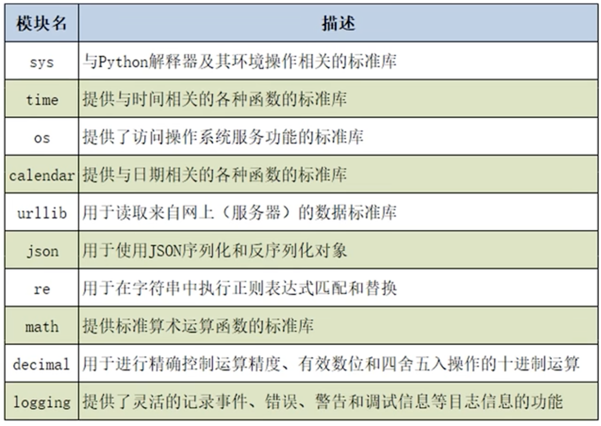

# 编码格式

## 常见的字符编码格式

Python的解释器使用的是Unicode(内存）
.py文件在磁盘上使用UTF-8存储（外存）

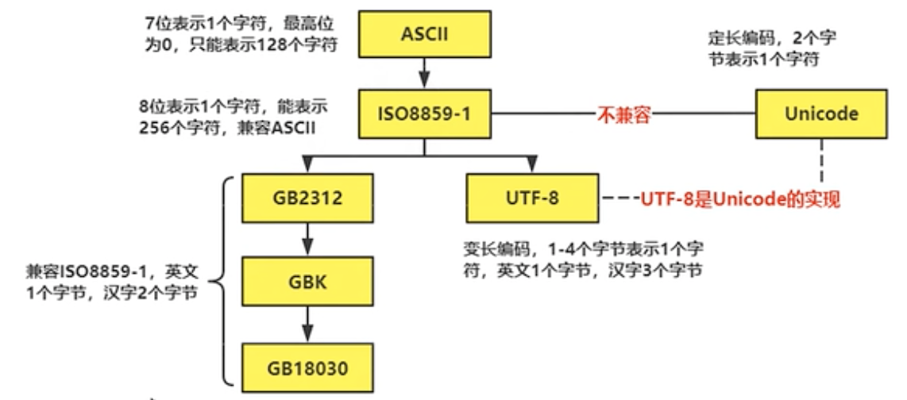

### Python 编码格式（申明）

- `py2` 文件编码默认是 `ascii` 来解释，`py3` 文件编码默认是 `utf-8`。
- 在执行 `py2` 文件时，如果不申明当前编码格式，则会按照默认的 `ascii` 编码执行。

```
# 下面两种方式，取一种就行，都一样，然后放在文件头部
# encoding=utf-8
# encoding:utf-8
```


# 文件的读写操作

文件的读写俗称“IO操作”

文件的读写操作流程

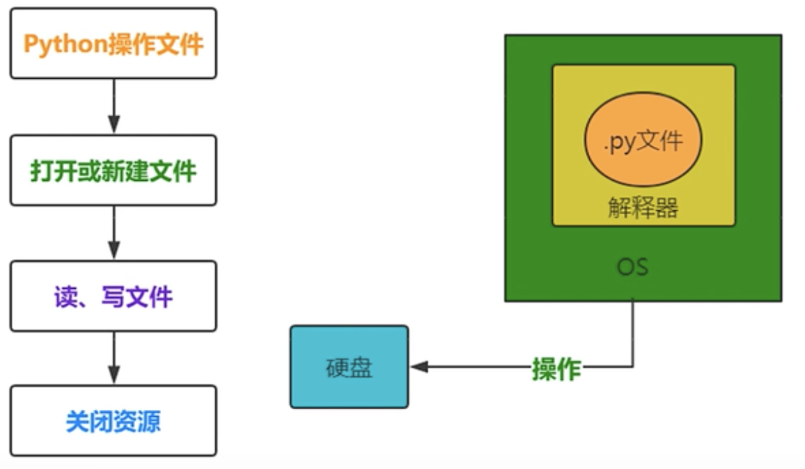


## open()语法规则

open()创建文件对象


## 常用的文件打开模式

文本文件：存储的是普通“字符"文本，默认为unicode字符集，可以使用记本事程序打开
二进制文件把数据内容用“字节"”进行存储，无法用记事本打开，必须使用专用的软件打开，举例：mp3音频文件，jpg图片.doc文档等


## 文件对象的常用方法

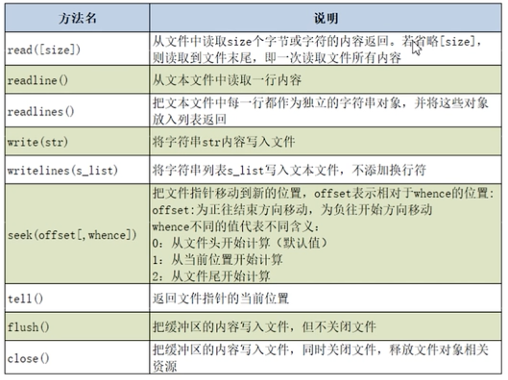

# with语句（上下文管理器）

wth语句可以自动管理上下文资源，不论什么原因跳出wth块都能确保文件正确的关闭，以此来释放资源

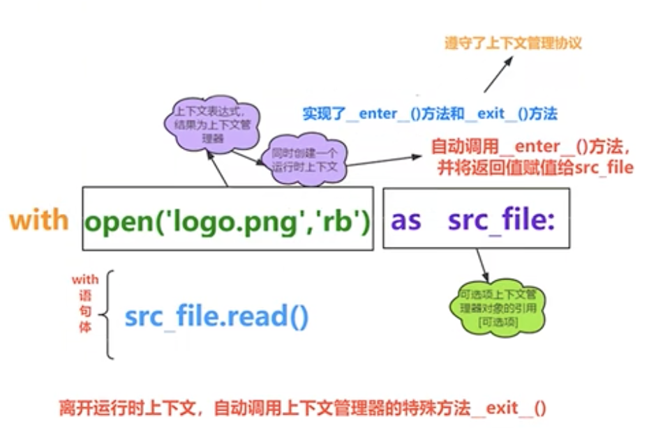

# 目录操作

os模块是Python内置的与**操作系统功能和文件系统相关的模块**，该模块中的语句的执行结果通常与操作系统有关，在不同的操作系统上运行，得到的结果可能不一样
		os模块与os.path模块用于对目录或文件进行操作

## os模块的常用函数

```python
import os
os.system('notedpad.exe')
#直接调用可执行文件
os.startfile('可执行文件的位置')
```

| 函数                               | 说明                           |
| ---------------------------------- | ------------------------------ |
| getcwd()                           | 返回当前的工作目录             |
| listdir (path)                     | 返回指定路径下的文件和目录信息 |
| mkdir (path[, mode])               | 创建目录                       |
| makedirs (path1/path2... [, mode]) | 创建多级目录                   |
| chdir (path)                       | 将path设置为当前工作目录       |

## os.path模块操作目录相关函数

| 函数              | 说明                                                         |
| ----------------- | ------------------------------------------------------------ |
| abspath (path)    | 用于获取文件或目录的绝对路径                                 |
| exists (path)     | 用于判断文件或目录是否存在，如果存在返回True,<br/>否则返回False |
| join (path, name) | 将目录与目录或者文件名拼接起来                               |
| splitext ()       | 分离文件名和扩展名                                           |
| basename (path)   | 从一个目录中提取文件名                                       |
| dirname (path)    | 从一个路径中提取文件路径，不包括文件名                       |
| isdir (path)      | 用于判断是否为路径                                           |
|                   |                                                              |

# python执行系统命令的方法

Python的os模块，见名之意，opera system的意思是毫无疑问了。该模块是Python的内建模块，也可以说是内建库了，该模块内的函数自然也是内建函数了，我们要和系统命令交互，需要使用它的system（），popen（）这两个函数，或者使用commands模块，或者使用subprocess模块，前面两个函数和commands模块是比较陈旧的，现在**官方比较推荐也可以说强烈推荐的是subprocess模块。**

(1) os.system（系统层面的直接调用），这个调用相当直接，且是同步进行的，程序需要阻塞并等待返回。返回值是依赖于系统的，直接返回系统的调用返回值，所以windows和linux是不一样的。

仅仅在一个子终端运行系统命令，而不能获取命令执行后的返回信息

(2) os.popen（新开线程方式），可以看出，popen方法通过p.read()获取终端输出，而且popen需要关闭close().当执行成功时，close()不返回任何值，失败时，close()返回系统返回值. 可见它获取返回值的方式和os.system不同。

该方法不但执行命令还返回执行后的信息对象，好处在于：将返回的结果赋于一变量，便于程序的处理。

(3)  使用模块 commands（ python3失效）

（4）  使用模块 subprocess（Python文档中目前全力推荐），直接调用命令，返回值即是系统返回。shell=True表示命令最终在shell中运行。Python文档中出于安全考虑，不建议使用shell=True。

## os.system（系统层面的直接调用）

```python
import os
os.system('git status')
os.system('git add .')
```


```
import os
import commands
print('=============================ls')
os.system('ls -al /')
print('===========df')
df = os.popen('df -ah').read()
print(df)
print('=========================free')
a = commands.getoutput("free -mh")
```


print(a)
输出结果为：

```
===========================ls
total 28
dr-xr-xr-x.  17 root root  244 Jan 24 12:11 .
dr-xr-xr-x.  17 root root  244 Jan 24 12:11 ..
-rw-r--r--    1 root root    0 Jan 24 12:11 .autorelabel
lrwxrwxrwx.   1 root root    7 Jan 24 11:12 bin -> usr/bin
dr-xr-xr-x.   5 root root 4096 Jan 24 12:11 boot
drwxr-xr-x   19 root root 3320 Feb  1 09:29 dev
drwxr-xr-x. 138 root root 8192 Feb  1 09:29 etc
drwxr-xr-x.   2 root root    6 Nov  5  2016 home
lrwxrwxrwx.   1 root root    7 Jan 24 11:12 lib -> usr/lib
lrwxrwxrwx.   1 root root    9 Jan 24 11:12 lib64 -> usr/lib64
drwxr-xr-x.   2 root root    6 Nov  5  2016 media
drwxr-xr-x.   3 root root   19 Jan 24 11:34 mnt
drwxr-xr-x.   4 root root   34 Jan 24 11:58 opt
dr-xr-xr-x  229 root root    0 Feb  1 09:29 proc
dr-xr-x---.  11 root root 4096 Feb  1 09:30 root
drwxr-xr-x   39 root root 1200 Feb  1 09:29 run
lrwxrwxrwx.   1 root root    8 Jan 24 11:12 sbin -> usr/sbin
drwxr-xr-x.   2 root root    6 Nov  5  2016 srv
dr-xr-xr-x   13 root root    0 Feb  1 09:29 sys
drwxrwxrwt.  21 root root 4096 Feb  1 09:46 tmp
drwxr-xr-x.  13 root root  155 Jan 24 11:12 usr
drwxr-xr-x.  21 root root 4096 Jan 24 11:44 var
===========df
Filesystem      Size  Used Avail Use% Mounted on
rootfs             -     -     -    - /
sysfs              0     0     0    - /sys
proc               0     0     0    - /proc
devtmpfs        1.9G     0  1.9G   0% /dev
securityfs         0     0     0    - /sys/kernel/security
tmpfs           1.9G     0  1.9G   0% /dev/shm
devpts             0     0     0    - /dev/pts
tmpfs           1.9G  9.0M  1.9G   1% /run
tmpfs           1.9G     0  1.9G   0% /sys/fs/cgroup
cgroup             0     0     0    - /sys/fs/cgroup/systemd
pstore             0     0     0    - /sys/fs/pstore
cgroup             0     0     0    - /sys/fs/cgroup/pids
cgroup             0     0     0    - /sys/fs/cgroup/cpu,cpuacct
cgroup             0     0     0    - /sys/fs/cgroup/net_cls,net_prio
cgroup             0     0     0    - /sys/fs/cgroup/perf_event
cgroup             0     0     0    - /sys/fs/cgroup/freezer
cgroup             0     0     0    - /sys/fs/cgroup/memory
cgroup             0     0     0    - /sys/fs/cgroup/cpuset
cgroup             0     0     0    - /sys/fs/cgroup/hugetlb
cgroup             0     0     0    - /sys/fs/cgroup/blkio
cgroup             0     0     0    - /sys/fs/cgroup/devices
configfs           0     0     0    - /sys/kernel/config
/dev/sda6        70G  4.7G   66G   7% /
systemd-1          -     -     -    - /proc/sys/fs/binfmt_misc
debugfs            0     0     0    - /sys/kernel/debug
mqueue             0     0     0    - /dev/mqueue
hugetlbfs          0     0     0    - /dev/hugepages
nfsd               0     0     0    - /proc/fs/nfsd
/dev/sr0        4.3G  4.3G     0 100% /mnt/cdrom
/dev/sda3       5.0G   33M  5.0G   1% /home
/dev/sda2        20G  164M   20G   1% /var
/dev/sda1       497M  128M  370M  26% /boot
sunrpc             0     0     0    - /var/lib/nfs/rpc_pipefs
tmpfs           378M  4.0K  378M   1% /run/user/0
binfmt_misc        0     0     0    - /proc/sys/fs/binfmt_misc

=========================free
              total        used        free      shared  buff/cache   available
Mem:           3.7G        939M        1.8G        8.9M        1.0G        2.5G
Swap:          4.0G          0B        4.0G
```

以上是os模块的system方法，popen方法和commands库调用Linux库的方法。后续补充subprocess的调用Linux系统命令的方法。（人在外面没Python环境）
原文链接：https://blog.csdn.net/alwaysbefine/article/details/113485055

## subprocess

subprocess 模块允许我们启动一个新进程，并连接到它们的输入/输出/错误管道，从而获取返回值。

## 使用 subprocess 模块

subprocess 模块首先推荐使用的是它的 run 方法，更高级的用法可以直接使用 Popen 接口。

**run 方法语法格式如下：**

```
subprocess.run(args, *, stdin=None, input=None, stdout=None, stderr=None, capture_output=False, shell=False, cwd=None, timeout=None, check=False, encoding=None, errors=None, text=None, env=None, universal_newlines=None)
```

- args：表示要执行的命令。必须是一个字符串，字符串参数列表。
- stdin、stdout 和 stderr：子进程的标准输入、输出和错误。其值可以是 subprocess.PIPE、subprocess.DEVNULL、一个已经存在的文件描述符、已经打开的文件对象或者 None。subprocess.PIPE 表示为子进程创建新的管道。subprocess.DEVNULL 表示使用 os.devnull。默认使用的是 None，表示什么都不做。另外，stderr 可以合并到 stdout 里一起输出。
- timeout：设置命令超时时间。如果命令执行时间超时，子进程将被杀死，并弹出 TimeoutExpired 异常。
- check：如果该参数设置为 True，并且进程退出状态码不是 0，则弹 出 CalledProcessError 异常。
- encoding: 如果指定了该参数，则 stdin、stdout 和 stderr 可以接收字符串数据，并以该编码方式编码。否则只接收 bytes 类型的数据。
- shell：如果该参数为 True，将通过操作系统的 shell 执行指定的命令。

run 方法调用方式返回 CompletedProcess 实例，和直接 Popen 差不多，实现是一样的，实际也是调用 Popen，与 Popen 构造函数大致相同，例如:

## 实例

```python
\#执行ls -l /dev/null 命令
\>>> subprocess.run(["ls", "-l", "/dev/null"])
crw-rw-rw-  1 root  wheel   3,  2 5 4 13:34 /dev/null
CompletedProcess(args=['ls', '-l', '/dev/null'], returncode=0)
```

**returncode**: 执行完子进程状态，通常返回状态为0则表明它已经运行完毕，若值为负值 "-N",表明子进程被终。

简单实例：

## 实例

```python
import subprocess
def runcmd(command):
    ret = subprocess.run(command,shell=True,stdout=subprocess.PIPE,stderr=subprocess.PIPE,encoding="utf-8",timeout=1)
    if ret.returncode == 0:
        print("success:",ret)
    else:
        print("error:",ret)


runcmd(["dir","/b"])#序列参数
runcmd("exit 1")#字符串参数
```

输出结果如下：

```
success: CompletedProcess(args=['dir', '/b'], returncode=0, stdout='test.py\n', stderr='')
error: CompletedProcess(args='exit 1', returncode=1, stdout='', stderr='')
```

------

## Popen() 方法

Popen 是 subprocess的核心，子进程的创建和管理都靠它处理。

构造函数：

```
class subprocess.Popen(args, bufsize=-1, executable=None, stdin=None, stdout=None, stderr=None, 
preexec_fn=None, close_fds=True, shell=False, cwd=None, env=None, universal_newlines=False, 
startupinfo=None, creationflags=0,restore_signals=True, start_new_session=False, pass_fds=(),
*, encoding=None, errors=None)
```

**常用参数：**

- args：shell命令，可以是字符串或者序列类型（如：list，元组）
- bufsize：缓冲区大小。当创建标准流的管道对象时使用，默认-1。
  0：不使用缓冲区
  1：表示行缓冲，仅当universal_newlines=True时可用，也就是文本模式
  正数：表示缓冲区大小
  负数：表示使用系统默认的缓冲区大小。
- stdin, stdout, stderr：分别表示程序的标准输入、输出、错误句柄
- preexec_fn：只在 Unix 平台下有效，用于指定一个可执行对象（callable object），它将在子进程运行之前被调用
- shell：如果该参数为 True，将通过操作系统的 shell 执行指定的命令。
- cwd：用于设置子进程的当前目录。
- env：用于指定子进程的环境变量。如果 env = None，子进程的环境变量将从父进程中继承。

创建一个子进程，然后执行一个简单的命令:

## 实例

\>>> **import** subprocess
\>>> p = subprocess.Popen('ls -l', shell=True)
\>>> total 164
-rw-r--r--  1 root root  133 Jul  4 16:25 admin-openrc.sh
-rw-r--r--  1 root root  268 Jul 10 15:55 admin-openrc-v3.sh
...
\>>> p.returncode
\>>> p.wait()
0
\>>> p.returncode

这里也可以使用 **p = subprocess.Popen(['ls', '-cl'])** 来创建子进程。

### Popen 对象方法

- poll(): 检查进程是否终止，如果终止返回 returncode，否则返回 None。
- wait(timeout): 等待子进程终止。
- communicate(input,timeout): 和子进程交互，发送和读取数据。
- send_signal(singnal): 发送信号到子进程 。
- terminate(): 停止子进程,也就是发送SIGTERM信号到子进程。
- kill(): 杀死子进程。发送 SIGKILL 信号到子进程。

## 实例

**import** time
**import** subprocess

**def** cmd(command):
  subp = subprocess.Popen(command,shell=True,stdout=subprocess.PIPE,stderr=subprocess.PIPE,encoding="utf-8")
  subp.wait(2)
  **if** subp.poll() == 0:
    **print**(subp.communicate()[1])
  **else**:
    **print**("失败")


cmd("java -version")
cmd("exit 1")

输出结果如下：

```
java version "1.8.0_31"
Java(TM) SE Runtime Environment (build 1.8.0_31-b13)
Java HotSpot(TM) 64-Bit Server VM (build 25.31-b07, mixed mode)

失败
```

https://www.runoob.com/w3cnote/python3-subprocess.html

# 魔法方法

### 什么是Python魔法方法

    魔法方法是在Python的类中被双下划线前后包围的方法，如常见的 ：`init、new、__del__`等。这些方法在类或对象进行特定的操作时会自动被调用，我们可以使用或重写这些魔法方法，给自定义的类添加各种特殊的功能来满足自己的需求。

几乎每个魔法方法是python的内置方法。方法都有对应的内置函数，或者运算符，对这个对象使用这些函数或者运算符时就会调用类中的对应魔法方法，可以理解为重写这些python的内置函数

### 常用的魔法方法

#### init

    最为常见并熟知的魔法方法就是__init__()方法，可以用此方法来定义一个对象的初始化操作。例如：

```python
class MyClass:
    def __init__(self, a, b):
        self.a = a
        self.b = b
```

#### new

    init()方法很容易被认为是在实例化对象时调用的第一个方法，其实不是，当我们实例化一个对象的时候，例如class1=MyClass(1, 2)，第一个被调用的是__new__()方法，而后再调用__init__()方法，并把一些参数传给__init__()方法，new()方法才是真正地创建了实例化对象，init()方法只是给这个对象进行了初始化操作。

```python
class MyClass:
    def __init__(self, a, b):
        print("__init__()方法被调用")
        self.a = a
        self.b = b

    def __new__(cls, *args, **kwargs):
        print("__new__()方法被调用")
        print("args：", args)
        c = super().__new__(cls)
        return c


class1 = MyClass(1, 2)
复制代码
```

执行结果如下：  

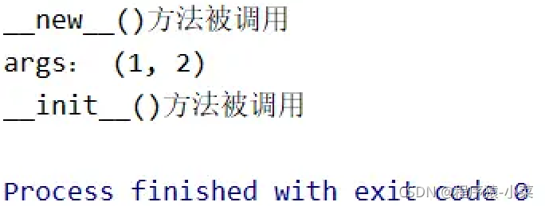    

    需要注意的是： new()方法第一个参数必须是cls参数，表示当前类，必须返回一个实例化对象，没有什么特别的需求，最好不用重写此方法。


参考链接：https://blog.csdn.net/m0_61655732/article/details/120647338

参考链接 https://blog.csdn.net/qq_38520096/article/details/79237593

# 附加

## 断言

```python
#     Python assert（断言）用于判断一个表达式，在表达式条件为 false 的时候触发异常
assert k > 1
```

## Python __call__()方法（详解版）

http://c.biancheng.net/view/2380.html