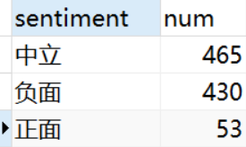

## MySQL 查询表的所有列名

查询某个数据库中某个表的所有列：

```mysql
SELECT COLUMN_NAME FROM information_schema.COLUMNS
WHERE TABLE_SCHEMA = 'db_name' AND TABLE_NAME = 'tb_name';
```


查询某个数据库中某个表的所有列名,并用逗号连接：

```mysql
SELECT GROUP_CONCAT(COLUMN_NAME SEPARATOR ",") FROM information_schema.COLUMNS 
WHERE TABLE_SCHEMA = 'db_name' AND TABLE_NAME = 'tb_name';
```

注意：只需要替换db_name(数据库名)和tb_name(表名)
原文链接：https://blog.csdn.net/CAI____NIAO/article/details/121532045

## MySQL统计一列中不同值（字段的不同值）的数量

参考链接：https://blog.csdn.net/xiangwangxiangwang/article/details/119109619

**使用count+group by**

```mysql
SELECT
	sentiment,
	count(*) num
FROM
	popular_feelings
GROUP BY
	sentiment;
```



